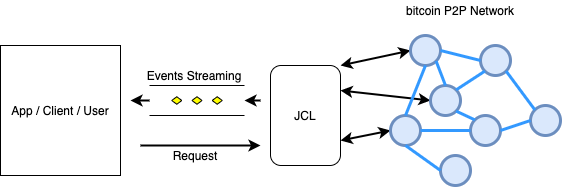

# JCL: Java Component Library for Bitcoin:: Quickstart tutorial

# Introduction

*JCL* is a Java Library or Suite of libraries that provides different functionalities needed by Blockchain projects. Some Modules will be commonly used by any project, whereas other might only be included if needed.

*JCL* is currently composed of the following modules:

 * *JCL-Base*: Base functionality. Provides definition for domain classes (*Transaction*, *Block*, etc).
 
 * *JCL-Net*: Provides Connections and Streaming capabilities, allowing an App to connect to the blockchain and "listen" to Events coming from it, and also too "send/broadcast" messages, and other operations.

## High-level view

All the libraries within *JCL* make up a hierarchy dependency tree, as shown in the diagram below:

 


> These different modules are stored as *JAR* Files in *Nexus*, which is the private *nChain* repository Server. In order to be able to download them you'll need a User and Password. In this tutorial we'll be using the *jenkins* user, which is a read-only profile that can be also used, although a specific user/passwd is preferred. Reach out to **Peter foster [p.foster@nchain.com]** for credentails.


# JCL-Base

*JCL-Base* is the basic Module in *JCL*. It provides very basic functionality, and it's meant to be a *base* module that can be further extended by importing another modules, like *JCL-Net*

**Use *JCL-Base* if you need to:**

 * Use/manipulate information about *Transactions*, *Blocks* etc.
 * Serialize information about Transactions, Inputs/Outputs or Blocks, so it can be further stored.


## How to import *JCL-Base*

> IMPORTANT: BEfore importing **JCL**into your project, check out the last version numbers in the Nexus Server, so you use the most recent one:
> 
> http://161.35.175.46:8081/#browse/browse:maven-releases


### in a *Gradle* project

Edit your *build.gradle* file and include the definition of the Repository:

```
repositories {
    ...
    maven {
        url "http://161.35.175.46:8081/repository/maven-releases/"
        credentials {
            username = "<NexusUser>"
            password = "<NexusPassword>"
        }
    }
}
```
> you can use *jenkins/jenkins* as credentials until you get the definitive ones. Bear in mind that the credentials are shown here in the *build.gradle* fle only for academic purposes. In a real project those should be stored in a a separate file (*gradle.properties*) and **not** shared.

then, add the dependency:

```
dependencies {
...
implementation 'com.nchain.jcl:jcl-base:0.0.1'
...
}

```

### in a *Maven* project

You need to define a new Repository in your *pom.xml* file:
```
<repositories>
	...
	<repository>
            <!--
            The username and password are retrieved by looking for the Repository
            Id in the $HOME/.m2/settings.xml file.
            -->
            <!-- id Must Match the Unique Identifier in settings.xml -->
            <id>nChain-Nexus-Repository</id>
            <url>http://161.35.175.46:8081/repository/maven-releases/</url>
            <releases/>
        </repository>
	...
</repositories>
```

then, add the dependency:

```
<dependencies>
	...
	<dependency>
      <groupId>com.nchain.jcl</groupId>
      <artifactId>jcl-base</artifactId>
      <version>0.0.1</version>
   </dependency>
	...
</dependencies>

```

And you must store the credentials in the *settings.xml* file:

```
<settings>
  <servers>
    ...
    <server>
      <id>nChain-Nexus-Repository</id>
      <username>jenkins</username>
      <password>jenkins</password>
    </server>
    ...
  </servers>
</settings>
```

> NOTE That the value of the **id** field must match the value of the **id** field in the *pom.xml* file.

 
## How to use *JCL-Base*


### Creating and manipulating *Bitcoin Objects*

 * The Objects containing information about *Transactions*, *Inputs*, *Outputs*, etc, are called "Bitcoin Objects*
 * A *Bitcoin Object* is created by using a *Builder* (a helper class)
 * A "Bitcoin Object" is **Immutable**. Once created, it cannot be modified
 * If you need to modify a *Bitcoin Object*, then you must crate a copy, change whatever information you want and *build* a new *bitcoin Object* from it.
 * A *Bitcoin Object* can be created directly from a *raw source* (a Byte Array or an Hexadecimal representation of it)

This is an example of how to create a *Transaction* from a *Byte Array* in *Hexadecimal* format:

```
String TX_HEX = "10000000193e3073ecc1d27f17e3d287cce..." // TX in HEX format
Tx tx = Tx.builder(TX_HEX).build();

```

You can also do the same with the *raw data (byte format)*:

```
byte[] TX_BYTES = ...
Tx tx = Tx.builder(TX_BYTES).build();
```

you can also make any changes you like before calling the *build()* method. And if you want to make change to an existing *Tx* object, you need to create a new one before that:

```
Tx originalTx = ...
Tx changedTx = originalTx.toBuilder()
                .lockTime(2) // a new locktime for the new Transaction...
                .build();

```

A *Bitcoin Object* can also be built **from scratch**, filling in all the values in the right fields. 


This is an example of how to build a *Transaction Input* from scratch, containing *10 Satoshis* and a dummy *unlocking script (an empty byte array of length 10)*

```
TxOutput txOutput = TxOutput.builder()
                       .value(Coin.valueOf(10))   // 10 Satoshis...
                       .scriptBytes(new byte[10]) // dummy script
                       .build();

```

This is an example of how to build a *Transaction Input* from scratch. In this case, an *Input* contains an inner structure called *OutputPoint*, which is created by using its respective *Builder*:

```
TxInput txInput = TxInput.builder()
                            .scriptBytes(new byte[10])
                            .sequenceNumber(1)      
                            .value(Coin.valueOf(5)). // 5 Satoshis...
                            .outpoint(TxOutPoint.builder()
                                    .hash(Sha256Wrapper.wrap(new byte[32])). // dummy Hash...
                                    .index(1)
                                    .build())
                            .build();
```

And this is an example of how to build a *Transaction* from scratch. A Transaction is a set of inputs, outputs and other related fields, in this case one single *Input* and one single *Output*:

```
TxInput input1 = ...
TxOutput output1 = ...
Tx tx = Tx.builder()
            .version(1)
            .lockTime(100)
            .inputs(Arrays.asList(input1))
            .outputs(Arrays.asList(output1))
            .build();

```

### Serializing *Bitcoin Objects*

Any *Bitcoin Objet* can be Serialzed or Deserialized. The way to do it is quite straightforward, and it works by using the *BitcoinSerialzierFactory* class.

For example, this is an example of Serialzing a *Transaction Input*, a *Transaction output* and a whole *Tranaction*:

```
TxInput txInput = ...
byte[] txInputSerialed = BitcoinSerializerFactory.serialize(txInput);
        
TxOutput txOutput = ...
byte[] txOutputSerialized = BitcoinSerializerFactory.serialize(txOutput);
        
Tx tx = ...
byte[] txSerialzied = BitcoinSerializerFactory.serialize(tx);

```

The same way, we can *Deserialize*  *raw data* into *Bitcoin Objects*. In this case we laso need to specify what class of object we are going to deserialzie and a *cast* is necessary at the end:

```
String TX_INPUT_HEX = ...
String TX_OUTPUT_HEX = ...
String TX_HEX = ...

TxInput txInput = (TxInput) BitcoinSerializerFactory.deserialize(TxInput.class, TX_INPUT_HEX);
TxOutput txOutput = (TxOutput) BitcoinSerializerFactory.deserialize(TxOutput.class, TX_INPUT_HEX);
Tx tx = (Tx) BitcoinSerializerFactory.deserialize(Tx.class, TX_INPUT_HEX);

```

In most ocassions, you won't need to deserilize small parts like *inputs* or *oututs*. but whole *transactions* instead. In those cases, it's much easier to use the *buider*, as it was shown at the beggining of this chapter:

```
String TX_HEX = ...
Tx tx = Tx.builder(TX_HEX).build();
```


# JCL-Net

The *JCL-Net* Module provides capabilities to Connect to a Blockchain network (you can choose from a set of different possible networks), and also **listen** to whatever hapens in those Networks and **react** to it.


The 3 main features provided by *JCL* are:

* Connection to the Blockchain Network: This includes not only the connection, but also all the *Bitcoin Protocol* 
  internals that are needed to main those connections alive (*Handshake* protocol, *timeout* (Ping/Pong), *Node-Discovery* 
  algorithm, Blacklist, etc)
  
* Streaming: *JCYL* can notify about any Event that might happen during your connection, so your application can 
  react to it. The application only needs to *subscribe* to the events it's interested int, and it wil get notified as soon 
  as they occur. 

* Requests: *JCYL* also provides a way for your application to make *Requests* to the Blockchain Network. Since
  *JCTYL* is a low-level library, these Requests are always related to different aspects of the protocol, like sendign a message, 
  connecting/disconnecting from a Peer, rquesting a TX or a Block, etc.
  



## How to import *JCL-Net* into your project
### in a *Gradle* project

Edit your *build.grtadle* file and include the definition of the Repository where *JCL-Base* is defined:

```
repositories {
    ...
    maven {
        url "http://161.35.175.46:8081/repository/maven-releases/"
        credentials {
            username = "<NexusUser>"
            password = "<NexusPassword>"
        }
    }
}
```
> you can use *jenkins/jenkins* as credentials until you get the definitive ones. Bear in mind that the credentials are shown here in the *build.gradle* fle only for academic purposes. In a real project those should be stored in a a separate file (*gradle.properties*) and **not** shared.

then, add *JCL-Base* as a dependency:

```
dependencies {
...
implementation 'com.nchain.jcl:jcl-base:0.0.1'
implementation 'com.nchain.jcl:jcl-net:0.0.1'
...
}

```

### in a *Maven* project
> COMMING SOON...


*JCLY* uses *logback* as loging system. In order to log the outut of the library, you need to add a *logback.xml* file 
into your classpath:

````
<configuration>
    <appender name="STDOUT" class="ch.qos.logback.core.ConsoleAppender">
        <encoder>
            <pattern>%d{yyyy-MM-dd HH:mm:ss.SSS} %-5level  - %msg%n</pattern>
        </encoder>
    </appender>
    
    <logger name="com.nchain.jcl" additivity="false">
        <level value="INFO" />
        <appender-ref ref="STDOUT" />
    </logger>
        
</configuration>
````

## Streaming:

### Simple connection:

The following example is just an example of how the connection is performed. We get a reference to the "P2P"
service from the *P2PBuilder* (specifying an identifier that is mostly used for logging), and then we start it. 
The service wil run in a different Thread, so all the Streaming services will be working in the background while 
our app performs other actions. In the example below though, the service will automaticallu stop after starting.

````
P2P p2p = P2P.builder("testing").build();
p2p.start(); // asynchronous...
// Do something useful here...
p2p.stop();
````


The output of the previous example:

````
2020-07-23 12:19:24.844 INFO   - testing :: P2P-Handler :: Starting...
2020-07-23 12:19:24.850 INFO   - testing :: P2P-Handler :: Configuration:
2020-07-23 12:19:24.854 INFO   - testing :: P2P-Handler ::  - BSV [main Net] configuration
2020-07-23 12:19:24.857 INFO   - testing :: P2P-Handler ::  - working dir: /var/folders/5z/nz8z4wp14fj6fmvmfrxp1cc40000gn/T/jcl
2020-07-23 12:19:24.885 INFO   - testing :: P2P-Handler ::  - peers range: [10 - 15]
2020-07-23 12:19:24.965 INFO   - testing :: P2P-Handler :: Stop.

````

We can see the Configuration used: *ProtocolBSVMain* by default, so the service will connect to the BSV Man network if
nothing else is specified. We also see the *working directory*, which is a temporary folder automatically picked up by the 
service to store some internal information. The Service has started in *Client Mode*, so it can connect to other Peers but it 
does Not allow incoming connections. The number of Peers connected will always remain in the range [10 -15].

If you want to allow incoming connections from Remote Peer, you just need to start in server mode:

````
...
p2p.startServer();
...
````

In this case, the Service will accept connections in the local IP address, using the port specified in the 
Configuration (in this specific example, the port number for BSV [main Net] is 8333)


## Connection and basic streaming

In the following example, we are streaming some events: The *P2P* object contains a *EVENTS* reference, which itself 
contains different references to different types of Events (Events related to Peers, to Messages, etc). 
We select the type of Event we are interested in, and then we add a callback by using the method *forEach* (in a similar 
way as the Java *Streams* work).

````
P2P p2p = new P2PBuilder("testing").build();

p2p.EVENTS.PEERS.CONNECTED.forEach(System.out::println);
p2p.EVENTS.PEERS.DISCONNECTED.forEach(System.out::println);
p2p.EVENTS.PEERS.HANDSHAKED.forEach(System.out::println);
p2p.EVENTS.MSGS.ALL.forEach(System.out::println);

p2p.start();
// We will be notified for 5 seconds...
Thread.sleep(5_000);
p2p.stop();
````

The parameter to the "forEach" methods is just an *Event* Object, which contains different information depending on the 
event itself. In this example we are just printing its content to the console, so the output for the previous code is 
as follows:

````
INFO   - testing :: P2P-Handler :: Starting...
INFO   - testing :: P2P-Handler :: Configuration:
INFO   - testing :: P2P-Handler ::  - com.nchain.jcl.protocol.config.provided.ProtocolBSVMainConfig@614ca7df configuration
INFO   - testing :: P2P-Handler ::  - working dir: /var/folders/5z/nz8z4wp14fj6fmvmfrxp1cc40000gn/T/jcl
Event[Peer Connected]: 206.189.104.98/206.189.104.98:8333
Event[Peer Connected]: 174.138.5.253/174.138.5.253:8333
Event[Peer Connected]: 68.183.42.63/68.183.42.63:8333
Event[Peer Connected]: 104.248.30.60/104.248.30.60:8333
Event[Peer Connected]: 167.99.92.186/167.99.92.186:8333
Event[Peer Connected]: 104.248.245.82/104.248.245.82:8333
Event[Msg Received]: VERSION : from 104.248.30.60/104.248.30.60:8333
Event[Msg Received]: VERACK : from 167.99.92.186/167.99.92.186:8333
Event[Msg Received]: VERSION : from 167.99.92.186/167.99.92.186:8333
Event[Msg Received]: VERACK : from 206.189.104.98/206.189.104.98:8333
Event[Msg Received]: VERSION : from 206.189.104.98/206.189.104.98:8333
Event[Msg Received]: VERACK : from 104.248.30.60/104.248.30.60:8333
Event[Peer Handshaked]: 174.138.5.253/174.138.5.253:8333 : /Bitcoin SV:1.0.4/
Event[Peer Handshaked]: 68.183.42.63/68.183.42.63:8333 : /Bitcoin SV:1.0.4/
Event[Peer Handshaked]: 206.189.104.98/206.189.104.98:8333 : /Bitcoin SV:1.0.4/
Event[Peer Handshaked]: 104.248.30.60/104.248.30.60:8333 : /Bitcoin SV:1.0.4/
Event[Peer Disconnected]: 206.189.81.233/206.189.81.233:8333: DISCONNECTED_BY_LOCAL
Event[Peer Disconnected]: 167.99.92.186/167.99.92.186:8333: DISCONNECTED_BY_LOCAL
Event[Peer Disconnected]: 159.65.152.200/159.65.152.200:8333: DISCONNECTED_BY_LOCAL
````

### Basic Customization and fine-tuning

The Configuration we use in the *P2P* Service can be changed in several ways, in this chapter we'll explain how to do a
very basic configuration changes, modifying some values:

* The network we connect to
* The range of Peers we want to be always connected to
* The *port* number we'll be listening at (if started in Server Mode)
* other network parameters...


Here we are connecting to a different network and changing the range of peers to [10,20].

````
ProtocolConfig config = new ProtocolBSVStnConfig(); // Different Network!!!
P2P p2p = new P2PBuilder("testing")
              .config(config)
              .minPeers(10)
              .maxPeers(15)
              .build();
...
````
In the previous exampe, we've used a different Class (*ProtocolBSVStnConfig*), which is a built-in class that already 
contains the configuration values to connect to the *Stress Net* in BSV. For test purposes, you can 
also use the original class for *BSV [main Net]* and change the parameters on the fly:

````
...
ProtocolConfig config = new ProtocolBSVMainConfig().toBuilder()
                    .magicPackage(0xe8f3e1e3L)
                    .port(8333)
                    .protocolVersion(ProtocolVersion.CURRENT.getBitcoinProtocolVersion())
                    .services(ProtocolServices.NODE_BLOOM.getProtocolServices())
                    .build();
P2P p2p = new P2PBuilder("testing")
              .config(config)
              ...                    

````

### Events Handling

Each Event is streamed through a callback that we define in the *forEach* method. In previous examples we only printed 
its content to the console, but we can implement any kind of logic. In the following example, we print an specific message 
if any peer we connect to has an specific protocol version number:

````
...
p2p.EVENTS.PEERS.HANDSHAKED.forEach(this::onPeerHandshaked);
...
void onPeerHandshaked(PeerHandshakedEvent event) {
 if (event.getVersionMsg().getVersion() < 70013)
     System.out.println("Version too low!!!");
}
...
````

> You can check that the parameter of the method is an instance of the *PeerHandshakedEvent* class. Each callback has a different *event* parameter, which varies according to the Event.
> 
> See the *Reference* for a Complete List of all the Events you stream and listen to.

### Status Streaming

Just by listening to the right events, the application can keep track of the number of Peers connected, messages 
exchanges, etc. Most of the time, this is useful information that can be used to trigger other functions or flows 
in our system. 

Other times, we just need to monitor the system, for example to print out the information about the number of Msgs 
exchanged per second, or the number of new Connections vs number of connections lost per hour, etc. Even though these 
"status" information can also be obtained by listening to the right Events and putting all the info together, *JCL* 
provides specific mechanisms to notify about the system *State*. These *State* Notifications are like any other 
Event, with the difference that they include some aggregate information that might help make a whole picture on the 
system. These *State* Events are triggered on a frequency basis, which must be specified before starting the service.

Here is an example:

````
P2P p2p = P2P.builder("testing")
              .publishStates(Duration.ofSeconds(5)) // We get notified every 5 seconds
              .build();
p2p.EVENTS.STATE.ALL.forEach(System.out::println);  // we print the State
p2p.start();
Thread.sleep(10_000); // we get notified for 10 seconds
p2p.stop();

````

And the output:


````
Event[State]: Network Handler State: Connections: 12 active, 0 pending to Open, 0 pending to Close: Running in Client Mode: connecting
Event[State]: Message Handler State: 63 incoming Msgs, 48 outcoming Msgs
Event[State]: Handshake Handler State: 12 current Handshakes, 0 failed.  More Connections requested
Event[State]: PingPong-Handler State: 0 Pings in progress
Event[State]: Discovery State:  Pool size: 0 [ 0 handshaked, 1000 added, 0 removed, 1045 rejected ] : 12 GET_ADDR sent, 4 ADDR received
Event[State]: Blacklist Status: [ 0 Addresses blacklisted ] count: {}
````
In the previous output we can see how different kinds of *State* Events have been triggered. That's because *JCYL* is 
internally composed of multiple *Handlers*, each one of them  taking care of an specific part of the 
*Bitcoin Protocol*, so we have then different status, each one related to one specific Handler.

Like with a regular Event, we can define the "forEach" callback in a separate method, and inspect the different State
Event Objects to get all the information we need from them.

> All the *State* Events, along with the rest of Events, are described in the **Reference** Section 

## Requests

In *JCYL* you can stream and listen to *Events*, but all the internals about the communication with other Peers are managed behind
the scenes, without external intervention. But in some scenarios, an Application might need to *React* and perform specific actions,
like:

 * Connect to an specific Peer
 * Disconnect form a Peer
 * Send an specific *msg* to a Peer
 * Broadcast a *Msg* to all the Peers
 * etc 

These operations and more are performend by *submiting* *Requests* to the *P2P* Service.

Example:

````
P2P p2p = P2P.builder("testing").build();
p2p.start();
....
// We connect to an specific Peer
p2p.REQUESTS.PEERS.connect("54.34.32.11:8333").submit();
....
// We disconnect from and specific Peer
p2p.REQUESTS.PEERS.disconnect("64.122.211.89:8333").submit();
...
p2p.stop();

````

In a similar way as with the *Events*, the *Requests* are also broken down into different categories depending on their 
use case, and all of them require a call to the *submit()* method in order to run.

It's important to notice that submitting a Request does **Not** guarantee that the Action will be performed, since 
the *P2P* Service will perform its own verifications before that. In any case, in order to check whether the action 
has been performed or not, you can listen to those Events that might confirm/deny that (if you request to connect to
a Peer, you can also listen to the *.EVENTS.PEERS.CONNECTED* to verify that the Request has gone through).


## Detailed View and advance-configuration:

*JCL-Net* follows a modular architecture, composed of multiple components called *Handlers*, each 
one of them implementing a different functionality. Some of these *Handlers* are designed as *Default 
handlers* and are mandatory, since critical parts of the *Bitcoin protocol* would be missing 
without them.

Others are optional, and provide other extra-functionalities. These are the "custom" handlers in the diagram below. 
More *Handlers* can be developed and *added* the the main *JCL* Service in runtime.


The Default Handlers are the following:

 * *Network/Connection Handler*: This handler implements the physical connection between *JCL* and the remote Peers, and 
 also manages all the communications with them (in raw format, byte array structure)
 
 * *Message Handler*: This Handler implements the Serialization/Deserialization process: It converts the raw data 
 exchanged over the network into a *Message* format which is better handled by the Application.
 
 * *Handshake Handler*: This handler performs the Handshake Protocol: Every time *JCL* connects to a remote Peer, the 
 hnadshake needs to be performed beween *JCL* and that Peer, before any exchange of information can be done. The *Handshake* 
 protocol is defined as an exchange of a series of messages between 2 parties until they either agree they can "talk" to each other, or
 are discarded.
 
 * *PingPong Handler*: This handler checks that a Remote Peer is still "alive", by sending them *ping* messages and waiting for
 the reply.
 
 * *Discovery Handler*: This handler is responsible for keeping an "alive" pool of Peer Addresses, so we can use it to connect 
 to more Peers if we need more connections. The way new Addresses are discovered is described as the "Node Discovery Algorithm", and 
 involves a request/response mechanism between different Peers, asking for new addresses and replying to those requests.
 
 * *Blacklist Handler*: This handler detects any situation when a Peer might be blacklisted, and it does so. It0's also responsible
 for whitelisting those Peer which have been blacklisted but which "fault" has expired already.

The *Custom* Handlers built-in in *JCL* are the following:

 * *Block Downloader*: This handler can get a list of Block hashes and download them from the Network. Depending 
 on configuration, multiple blocks can be download in parallel, and the same Block can be re-try if something goes wroing, 
 up to a limit of re-attempts. This Handler also provides support for *BigBlocks*. that means that it can download *ANY* 
 Block, regardless of its size (from MB to GB blocks). Different Events are also streamed so the App can be notified 
 about the downloading and deserialization process.
 
 > An specific chapter about *Block Downloading* with more details is provided in this documentation.

## Advance Configuration (fine-tunning):

> PENDING...


## Block Downloading

Downloading a Block can be done by the *BlockDownloader* Handler. This handler is already provided by *JCL*, so no additional
work is needed. The process to download a Block (or Blocks) is as follows:

 * We connect to the network using the *P2P* service as usual
 * We subscribe to the Block-related Events
 * We submit a "Request" to download a Block or a list of blocks
 * We listen to the Events and react ot them.
 
 When it comes to being notified about blocks being downloaded, we have several options:
 
 * *EVENTS.BLOCKS.BLOCK_DOWNLOADED*: This is triggered when a Block is downloaded, *regardless of its size*. 
 This Event provides information about the Peer that has sent the Block, the time it took to download it, and some 
 detailes about the Block (the Header), but the full content of the block is NOT provided.
 
 * *EVENTS.BLOCKS.LITE_BLOCK_DOWNLOADED*: This is triggered when the Block is downloaded and the Block 
 is not Considered a "Big Block" (A *Big Block* is a Block bigger than 10MB; although this is also configurable). This 
 event does have a reference to the whole block, including its transactions.
 

Since the Blocks can potentially be of *any* size, the full content of the Block is ONLY provided when the block
is small enough (a *Lite* Block). As a general Rule, if you want to get the Contents of the Block, you have to use the 
following Events:
 
  * *EVENTS.BLOCKS.BLOCK_HEADER_DOWNLOADED*: This is triggered when the Block Header of a BigBlock is downloaded
  * *EVENTS.BLOCKS.BLOCK_TXS_DOWNLOADED*: This is triggered when a Set of TXs from a Block has been 
      downloaded. Depending on the block size, we'll get several notifications of this Event.
        

 Using *BLOCK_HEADER_DOWNLOADED* and *BLOCK_TXS_DOWNLOADED*, you can get access to the Block content, without keeping it
 all in memory.
 
 
A lot of different things might go wrong during the download of a Block: The Peer we are connected to might drop the 
connection, or the speed of the bytes transfer drops and it becomes unusable, etc. This means that for some reason, a 
block might not be possible to download. If that situation occurs, the *Block Downloader* Handler will automatically 
try to download it again using a different Peer. But if the situations happens again and a maximum numbers of attempts is
reached, the Block might be discarded, which is something that can also be streamed through the 
*EVENTS.BLOCKS.BLOCK_DISCARDED* Event.
 
Example:

````
P2P p2p = new P2PBuilder("testing").build();

// We want to get notified when the block is downloaded or discarded for any reason:
p2p.EVENTS.BLOCKS.BLOCK_DOWNLOADED.forEach(System.out::println)
p2p.EVENTS.BLOCKS.BLOCK_DISCARDED.forEach(System.out.::println)

// We start the Connection and request to download a single Block:
p2p.start();
p2p.REQUESTS.BLOCKS.download("00000000000000000007f095af6667da606d2d060f3a02a9c6a1e6a2ef9fc4e9").submit();

// Do something...
p2p.stop();
````

If we want to get access to the *Content* of the block, we just need to listen to more Events:

````
...
p2p.EVENTS.BLOCKS.BLOCK_HEADER_DOWNLOADED.forEach(System.out::println)
p2p.EVENTS.BLOCKS.BLOCK_TXS_DOWNLOADED.forEach(System.out.::println)
...

````
 
 
# Reference

# Events
The following is a list of the most relevant Events that *JCYL* can stream. Each *Event* is represented by a JAva 
Object and it contains different types of information, depending on the event itself.

## Events related to Peers

### PeerConnectedEvent
``com.nchain.jcl.network.events.PeerConnectedEvent``

(*EVENTS.PEERS.CONNECTED*)

An Event triggered when a Peer is Connected. This is a physical connection (Socket Connection),
so the real communication with this Peer has not even started yet. Most probably you will be interested in the
*PeerHandshakedEvent*, which is triggered when a Peer is connected and the handshake is done, so real
communication can be performed.

### PeerDisconnectedEvent
``com.nchain.jcl.network.events.PeerDisconnectedEvent``

(*EVENTS.PEERS.DISCONNECTED*)

An Event triggered when a Peer is disconnected.

### PeerHandshakedEvent
``com.nchain.jcl.protocol.events.PeerHandshakedEvent``

(*EVENTS.PEERS.HANDSHAKED*)

An Event triggered when A Peer has been handshaked and it's ready to communicate with.

### PeerHandshakeRejectedEvent
``com.nchain.jcl.protocol.events.PeerHandshakeRejectedEvent``

(*EVENTS.PEERS.HANDSHAKED_REJECTED*)

An Event triggered when the Handshake with a Remote Peer has been rejected.

### PeerHandshakedDisconnectedEvent
``com.nchain.jcl.protocol.events.PeerHandshakedDisconnectedEvent``

(*EVENTS.PEERS.HANDSHAKED_DISCONNECTED*)

An Event triggered when a Peer that was currently handshaked, disconnects. This is a *convenience* event, since the
same information can be achieved by listening to the events *PeerHandshakedEvent* and *PeerDisconnectedEvent*

### MinHandshakedPeersReachedEvent
``com.nchain.jcl.protocol.events.MinHandshakedPeersReachedEvent``

(*EVENTS.PEERS.HANDSHAKED_MIN_REACHED*)

An Event triggered when the minimun number of Peers Handshaked has been reached, as specified in the P2P Configuration.
For example, if the peers range is specified to [10 - 12], this event will be notified when the service manages to connect 
to 10 Peers. This Event wil NOT be notified again UNTIL the number of Peers falls below the lower range (10) nad later on we manage to connect to 12 Peers again 

### MinHandshakedPeersLostEvent
``com.nchain.jcl.protocol.events.MinHandshakedPeersLostEvent``

(*EVENTS.PEERS.HANDSHAKED_MIN_Lost*)

An Event triggered when the Number of Peers Handshakes has dropped below the threshold specified in the P2P Configuration
For example, if the peers range is specified to [10 - 12], this event will be notified when the service is already 
connected to 10 or more Peers, and the number of connections drops below 10. 

### PingPongFailedEvent
``com.nchain.jcl.protocol.events.PingPongFailedEvent``

(*EVENTS.PEERS.PINGPONG_FAILED*)

An Event triggered when a Peer has failed to perform the Ping/Pong Protocol, which means that a PING message has been sent
 to this Peer but it has not reply with a PONG message within the time frame specified in the Configuration.
 
> Note: This event only notifies the fact. If you want to check if some action has been taken on this Peer due to this, you 
should listen to the *PeerDisconnectedEvent* or "PeerBlacklistedEvent" Events. 


### PeersBlacklistedEvent
``com.nchain.jcl.protocol.events.PeersBlacklistedEvent``

(*EVENTS.PEERS.BLACKLISTED*)

An Event triggered when a set of Nodes is blacklisted. (Ahole IP address is blacklisted, no mater the port number)
It also provides information about the REASON why it's been blacklisted, which also contains the expirationTime (the date after which this Peer is whitelisted and can be used again).

### PeersWhitelistedEvent
``com.nchain.jcl.protocol.events.PeersWhitelistedEvent``

(*EVENTS.PEERS.WHITELISTED*)

An event triggered when a set of IP Addresses has been whitelisted (back to business again)

## Events related to Bitcoin Messages

### MsgReceivedEvent
``com.nchain.jcl.protocol.events.MsgReceivedEvent``

(*EVENTS.MSGS.ALL*)

An Event triggered when a Message is received from a Remote Peer. If you are interested only in a subset of all possible 
messages, you can either implement your own logic into the callback to filter them out, or you can also use the different 
and more specific Events provided:

 * (*EVENTS.MSGS.ADDR*)
 * (*EVENTS.MSGS.BLOCK*)
 * (*EVENTS.MSGS.FEE*)
 * (*EVENTS.MSGS.GET_ADDR*)
 * (*EVENTS.MSGS.GET_DATA*)
 * (*EVENTS.MSGS.INV*)
 * (*EVENTS.MSGS.NOT_FOUND*)
 * (*EVENTS.MSGS.PING*)
 * (*EVENTS.MSGS.REJECT*)
 * (*EVENTS.MSGS.TX*)
 * (*EVENTS.MSGS.VERSION*)
 * (*EVENTS.MSGS.VERSION_ACK*)

> MORE MESSAGES COMING UP...

### MsgSentEvent
``com.nchain.jcl.protocol.events.MsgSentEvent``

(*EVENTS.MSGS.ALL_SENT*)

An Event triggered when a Message is sent to a Remote Peer. If you are interested only in a subset of all possible 
messages, you can either implement your own logic into the callback to filter them out, or you can also use the different 
and more specific Events provided:

 * (*EVENTS.MSGS.ADDR_SENT*)
 * (*EVENTS.MSGS.BLOCK_SENT*)
 * (*EVENTS.MSGS.FEE_SENT*)
 * (*EVENTS.MSGS.GET_ADDR_SENT*)
 * (*EVENTS.MSGS.GET_DATA_SENT*)
 * (*EVENTS.MSGS.INV_SENT*)
 * (*EVENTS.MSGS.NOT_FOUND_SENT*)
 * (*EVENTS.MSGS.PING_SENT*)
 * (*EVENTS.MSGS.REJECT_SENT*)
 * (*EVENTS.MSGS.TX_SENT*)
 * (*EVENTS.MSGS.VERSION_SENT*)
 * (*EVENTS.MSGS.VERSION_ACK_SENT*)
 
 > MORE MESSAGES COMING UP...
 
## Events related to *States*:
These Events, unlike the rest of Events in *JCL*, are triggered always on a frequency basis, which has to be specified *before* 
running the service.

### NetworkHandlerState
``com.nchain.jcl.network.events.HandlerStateEvent``

(*EVENTS.STATE.NETWORK*)

This Event stores the current State of the Connection/Network Handler. The Network Handler implements the
physical and low-level connection to a remote Peers, and handles all the incoming/outcoming data between
the 2 parties.

You must cast the Handler State:

````
...
public void onState(HandlerStateEvent event) {
    NetworkHandlerState state = (NetworkHandlerState) event.getState();
    ...
}
...
````
 
### MessageHandlerState
``com.nchain.jcl.network.events.HandlerStateEvent``

(*EVENTS.STATE.MESSAGES*)

This event stores the state of the Handshake Handler at a point in time.
The Message Handler takes care of the Serialization/Deserialization of the information coming
from/to the Blockchain P2P Network, converting Bitcoin Messages into bytes (raw data) and the
other way around.

This events keeps track of the number of bitcoin messages sent to and received from the network.

You must cast the Handler State:

````
...
public void onState(HandlerStateEvent event) {
    MessageHandlerState state = (MessageHandlerState) event.getState();
    ...
}
...
````

### HandshakeHandlerState
``com.nchain.jcl.network.events.HandlerStateEvent``

(*EVENTS.STATE.HANDSHAKE*)

This event stores the state of the Handshake Handler at a point in time.
the Handshake Handler takes care of implementing the Handshake Protocol, which takes place
right after connecting to a new Peer. It consists of a exchange of messages between the 2
parties to verify that they are protocol-compatible.
 
This event stores the number of Peers currently handshaked or failed, and also some flags
that indicate if the Service has been requested to look for more Peers or to stop new connections
instead (these request to resume/stop connections are always triggered when the nuymber of
Peer handshakes go above or below some thresholds).

You must cast the Handler State:

````
...
public void onState(HandlerStateEvent event) {
    HandshakeHandlerState state = (HandshakeHandlerState) event.getState();
    ...
}
...
````


### PingPongHandlerState
``com.nchain.jcl.network.events.HandlerStateEvent``

(*EVENTS.STATE.PINGPONG*)

 This event stores the state of the PingPong Handler at a point in time.
 The PingPong Handler takes care of checking that the Remote Peers we are connected to are still
 "alive". On a frequency basis, it sends a PING message to them, expecting a PONG message back. If
 the response does not come or comes out of time, the Peer has then broken the timeout and will most
 probably be blacklisted.
 
 You must cast the Handler State:
 
 ````
 ...
 public void onState(HandlerStateEvent event) {
     PingPongHandlerState state = (PingPongHandlerState) event.getState();
     ...
 }
 ...
 ````
 

### DiscoveryHandlerState
``com.nchain.jcl.network.events.HandlerStateEvent``

(*EVENTS.STATE.DISCOVERY*)

 This event stores the state of the Discovery Handler at a point in time.
 The Discovery Handler takes care of feeding the Service with enough addresses of Remote Peers, so
 we have a "pool" of addresses we can use when we need to connect to more Peers.
 
 You must cast the Handler State:
 
  ````
  ...
  public void onState(HandlerStateEvent event) {
      DiscoveryHandlerState state = (DiscoveryHandlerState) event.getState();
      ...
  }
  ...
  ````
  
 
### BlacklistHandlerState
``com.nchain.jcl.network.events.HandlerStateEvent``

(*EVENTS.STATE.BLACKLIST*)

 This event stores the state of the Blacklist Handler at a point in time.
 The Blacklist Handler takes care of Blacklisting (and whitelisting) Peers when some conditions are
 met: they failed during the handshake, or broken the timeout specified by the PingPong Handler, etc.
 
 You must cast the Handler State:
 
   ````
   ...
   public void onState(HandlerStateEvent event) {
       BlacklistHandlerState state = (BlacklistHandlerState) event.getState();
       ...
   }
   ...
   ````
   
## Events related to Block Downloading

### BlockDownloadedEvent

``com.nchain.jcl.protocol.events.BlockDownloadedEvent``

(*EVENTS.BLOCKS.BLOCK_DOWNLOADED*)

An Event triggered when a Block has been fully downloaded, including its TXs. Since a Block could potentially
use more memory than the HW available, this Event only notifies the FACT that the block has been downloaded, and
also provides some info about it (like the Block Header, or the Peer it's been downloaded from).

### LiteBlockDownloadedEvent

``com.nchain.jcl.protocol.events.LiteBlockDownloadedEvent``

(*EVENTS.BLOCKS.LITE_BLOCK_DOWNLOADED*)

An Event triggered when a "Lite" Block has been downloaded. A Lite block is a block which size is small enough
to be put into memory without risking running out of it.

NOTE:
When listening for Events regarding Blocks downloaded, the best approach is to listen to "BlockDownloadedEvent"
instead, which is always triggered regardless of the block size. This event here thought is only triggered when
the Block is NOT Big

### BlockHeaderDownloadedEvent

``com.nchain.jcl.protocol.events.BlockHeaderDownloadedEvent``

(*EVENTS.BLOCKS.BLOCK_HEADER_DOWNLOADED*)

An Event triggered when a Block Header has been downloaded.

### BlockTXsDownloadedEvent

``com.nchain.jcl.protocol.events.BlockTXsDownloadedEvent``

(*EVENTS.BLOCKS.BLOCK_TXS_DOWNLOADED*)

An Event triggered when a Set of TXs from a Block has been downloaded. If you want to get notified when all the
TXs have been downloaded and the block has been fully download, use the BlockDownloadedEvent.

### BlockDiscardedEvent

``com.nchain.jcl.protocol.events.BlockDiscardedEvent``

(*EVENTS.BLOCKS.BLOCK_DISCARDED*)

An Event triggered when a Block, which has been requested to download, is discarded for any reason. This event 
provides info about the Block (Hash) and the reason why the Block has been discarded
A Block discarded might be attempted again after some time, depending on configuration.