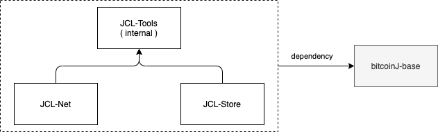

# JCL: Java Component Library for Bitcoin


# Introduction

*JCL* is a Java Library or Suite of libraries that provides different functionalities needed by Blockchain projects. Some Modules will be commonly used by any project, whereas others might only be included if needed.

*JCL* is currently composed of the following modules:

> **Click on the Links below to access each module specific documentation:**

 * [JCL-Base](JCL-BASE.md): Base functionality. Provides definition for domain classes (*Transaction*, *Block*, etc) and Serialization.
 
 * [JCL-Net](JCL-NET.md): Provides Connections and Streaming capabilities, allowing an App to connect to the blockchain and "listen" to Events coming from it, and also "send/broadcast" messages, and other operations.

 * [JCL-Script](JCL-Script.md): Provides capabilities to Run *Bitcoin Scripts*

All the libraries within *JCL* make up a hierarchy dependency tree, as shown in the diagram below:

 


# How to import JCL

Since *JCL* is made up of different modules, "importing JCL" actually means "importing a JCL Module". The specific module to import will depends on your needs.

> **NOTE**
> The JCL Modules are stored in a *Nexus* server in *nChain* premises, so before going any further you'll need a *user* and *password* so you can access it and download the libraries from it. From this moment moving forward, the credentials will be referenced as **NEXUS_USER** and **NEXUS_PASSWORD** in this documentation.


## Import JCL in a *Gradle* project

Edit your *build.gradle* file and include the definition of the Repository:

```
repositories {
    ...
    maven {
        url "http://161.35.175.46:8081/repository/maven-releases/"
        credentials {
            username = "NEXUS USER"
            password = "NEXUS PASSWORD"
        }
    }
}
```
> Bear in mind that the credentials are shown here in the *build.gradle* file only for academic purposes. In a real project those should be stored in a a separate file (*gradle.properties*) and **not** shared.

then, add the dependency (replace the module with the one you actually need):

```
dependencies {
...
implementation 'com.nchain.jcl:jcl-base:0.0.1'
...
}

```

## Import JCL in a *Maven* project

You need to define a new Repository in your *pom.xml* file:

```
<repositories>
	...
	<repository>
            <!--
            The username and password are retrieved by looking for the Repository
            Id in the $HOME/.m2/settings.xml file.
            -->
            <!-- id Must Match the Unique Identifier in settings.xml -->
            <id>nChain-Nexus-Repository</id>
            <url>http://161.35.175.46:8081/repository/maven-releases/</url>
            <releases/>
        </repository>
	...
</repositories>
```

then, add the dependency:

```
<dependencies>
	...
	<dependency>
      <groupId>com.nchain.jcl</groupId>
      <artifactId>jcl-base</artifactId>
      <version>0.0.1</version>
   </dependency>
	...
</dependencies>

```

And you must store the credentials in the *settings.xml* file:

```
<settings>
  <servers>
    ...
    <server>
      <id>nChain-Nexus-Repository</id>
      <username><NEXUS USER></username>
      <password><NEXUS PASSWORD></password>
    </server>
    ...
  </servers>
</settings>
```

> NOTE That the value of the **id** field must match the value of the **id** field in the *pom.xml* file.

> **Developers Note:** The Maven dependencies in a *Java/Kotlin* project work in a *transitive* way, so if you import a Module *A* and this module *A* has a dependency on the module *B*, then the module *B* is automatically imported as well. But in some occasiones, this *transitive* behaviour does not work as pexpected when the libraries are coming from a "private" repository, like just in this case. So if you detected that not all the *JCL* dependencies are imported when you import a *JCL* Module, you might have to import them specifically.
 
