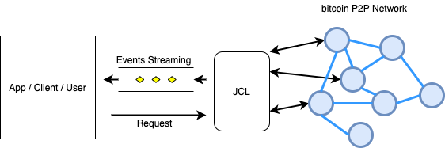
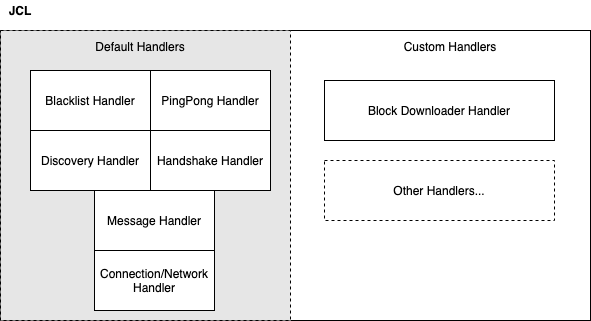
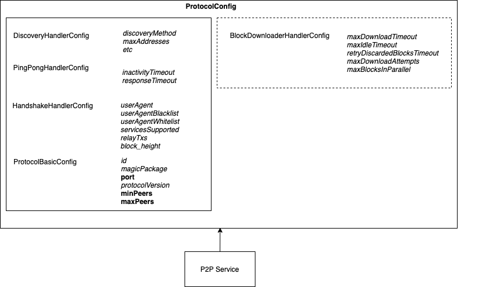

# JCL-Net

The *JCL-Net* Module provides capabilities to Connect to a Blockchain network (you can choose from a set of different possible networks), and also **listen** to whatever happens in those Networks and also to **React** to it.


The 3 main features provided by *JCL* are:

* Connect to the Blockchain Network: This includes not only the connection, but also all the *Bitcoin Protocol* 
  internals that are needed to keep those connections alive (*Handshake* protocol, *timeout* (Ping/Pong), *Node-Discovery* 
  algorithm, Blacklist, etc)
  
* Stream Events: *JCL* can notify about any Event that might happen during your connection, so your application can 
  react to it. The application only needs to *subscribe* to the events it's interested int, and it wil get notified as soon 
  as they occur. 

* Request and action: *JCL* also provides a way for your application to make *Requests* to the Blockchain Network. Since
  *JCYL* is a low-level library, these Requests are always related to different aspects of the protocol, like sendign a message, 
  connecting/disconnecting from a Peer, requesting a TX or a Block, etc.
  



## How to use *JCL-Net*

### Basic Setup:

The use of *JCL-Net* and any other *JCL* Module always follows the same approach: we define a *Configuration* for the Module we are using, and then we create an *instance* of that module applying that Configuration.

And is some cases there is no just one *Configuration*. there might be several *Configurations* that apply to different contexts. The most basic Configuration that can be set in *JCL* is a ``Runtime Configuration``:

```
RuntimeConfig runtimeConfig = new RuntimeConfigDefault();
```

The ``RuntimeConfig`` contains values about the *SW* and *HW* environment where the Application is going to be running. At the time of writting this documentation, the implementation provided by the ``RuntimeConfigDefault``class is enough for all cases, so in most of the examples below in this document, this configuration can be ommitted and will be automatically picked up by the system.


### P2P Setup:

In the following snippet we set up the Configuration and we get an instance of the *P2P* Service, which is the main Service in this module:

```
ProtocolConfiguration protocolConfig = new ProtocolBSVMainConfig();
P2P p2p = P2P.builder("testing").
	.config(protocolConfig)
	.build();
```

The previous Configuration will make the *P2P* Service to connect to the *BSV Main* Network, but other Configurations are possible out of the box:

 * ``ProtocolBSVStnConfig``
 * ``ProtocolBTCMAinConfig``


The *P2P* Service just created contains a ``ProtocolConfig``, but it also contains a ``RuntimeConfig``, automatically created by default. The previous code is equivalente to this one:

```
RuntimeConfig runtimeConfig = new RuntimeConfigDefault();
ProtocolConfiguration protocolConfig = new ProtocolBSVMainConfig();
P2P p2p = P2P.builder("testing").
	.config(runtimeConfig)
	.config(protocolConfig)
	.build();
```

> The **ProtocolBSVMainConfig** is the DEFAULT, if not specified in the *P2P Builder*

### Streaming:

*Sreaming* is the most basic operation you can do, it mainly consists of *connecting* to the P2P network, and *streaming* events from it, events you can *subscribe* and *react* to.

#### Simple connection:

The following example is just an example of how the connection is performed. We get a reference to the *P2P*
service from the *P2PBuilder* (specifying an identifier that is mostly used for logging), and then we start it. 
The service wil run in a different Thread, so all the Streaming services will be working in the background while 
our app performs other actions. In the example below though, the service will automatically stop after starting.

```
P2P p2p = P2P.builder("testing").build();
p2p.start(); // asynchronous...
// Do something useful here...
p2p.stop();
```


The output of the previous example:

```
2020-07-23 12:19:24.844 INFO   - testing :: P2P-Handler :: Starting...
2020-07-23 12:19:24.850 INFO   - testing :: P2P-Handler :: Configuration:
2020-07-23 12:19:24.854 INFO   - testing :: P2P-Handler ::  - BSV [main Net] configuration
2020-07-23 12:19:24.857 INFO   - testing :: P2P-Handler ::  - working dir: /var/folders/5z/nz8z4wp14fj6fmvmfrxp1cc40000gn/T/jcl
2020-07-23 12:19:24.885 INFO   - testing :: P2P-Handler ::  - peers range: [10 - 15]
2020-07-23 12:19:24.965 INFO   - testing :: P2P-Handler :: Stop.

```

We can see int the output the Configuration used: *ProtocolBSVMain* by default, so the service will connect to the BSV Man network if
nothing else is specified. We also see the *working directory*, which is a temporary folder automatically picked up by the 
service to store some internal information. The Service has started in *Client Mode*, so it can connect to other Peers but it 
does Not allow incoming connections. The number of Peers connected will always remain in the range [10 -15].

If you want to allow incoming connections from Remote Peer, you just need to set up the port number and start in server mode

```
P2P p2p = P2P.builder("testing")
	.serverPort(0) // Random Port
	.build();
...
p2p.startServer();
...
```

#### Basic Event streaming

In the following example, we are streaming some events. The *P2P* object contains a *EVENTS* reference, which itself 
contains different references to different types of Events (Events related to Peers, to Messages, etc). 
We select the type of Event we are interested in, and then we add a callback by using the method *forEach* (in a similar 
way as the Java *Streams* work).

```
P2P p2p = new P2PBuilder("testing").build();

p2p.EVENTS.PEERS.CONNECTED.forEach(System.out::println);
p2p.EVENTS.PEERS.DISCONNECTED.forEach(System.out::println);
p2p.EVENTS.PEERS.HANDSHAKED.forEach(System.out::println);
p2p.EVENTS.MSGS.ALL.forEach(System.out::println);

p2p.start();
Thread.sleep(5_000); // We will be notified for 5 seconds...
p2p.stop();
```

The parameter to the *forEach* method is just an *Event* Object, which contains different information depending on the 
event itself. In this example we are just printing its content to the console, so the output for the previous code is 
as follows:

```
INFO   - testing :: P2P-Handler :: Starting...
INFO   - testing :: P2P-Handler :: Configuration:
INFO   - testing :: P2P-Handler ::  - com.nchain.jcl.protocol.config.provided.ProtocolBSVMainConfig@614ca7df configuration
INFO   - testing :: P2P-Handler ::  - working dir: /var/folders/5z/nz8z4wp14fj6fmvmfrxp1cc40000gn/T/jcl
Event[Peer Connected]: 206.189.104.98/206.189.104.98:8333
Event[Peer Connected]: 174.138.5.253/174.138.5.253:8333
Event[Peer Connected]: 68.183.42.63/68.183.42.63:8333
Event[Peer Connected]: 104.248.30.60/104.248.30.60:8333
Event[Peer Connected]: 167.99.92.186/167.99.92.186:8333
Event[Peer Connected]: 104.248.245.82/104.248.245.82:8333
Event[Msg Received]: VERSION : from 104.248.30.60/104.248.30.60:8333
Event[Msg Received]: VERACK : from 167.99.92.186/167.99.92.186:8333
Event[Msg Received]: VERSION : from 167.99.92.186/167.99.92.186:8333
Event[Msg Received]: VERACK : from 206.189.104.98/206.189.104.98:8333
Event[Msg Received]: VERSION : from 206.189.104.98/206.189.104.98:8333
Event[Msg Received]: VERACK : from 104.248.30.60/104.248.30.60:8333
Event[Peer Handshaked]: 174.138.5.253/174.138.5.253:8333 : /Bitcoin SV:1.0.4/
Event[Peer Handshaked]: 68.183.42.63/68.183.42.63:8333 : /Bitcoin SV:1.0.4/
Event[Peer Handshaked]: 206.189.104.98/206.189.104.98:8333 : /Bitcoin SV:1.0.4/
Event[Peer Handshaked]: 104.248.30.60/104.248.30.60:8333 : /Bitcoin SV:1.0.4/
Event[Peer Disconnected]: 206.189.81.233/206.189.81.233:8333: DISCONNECTED_BY_LOCAL
Event[Peer Disconnected]: 167.99.92.186/167.99.92.186:8333: DISCONNECTED_BY_LOCAL
Event[Peer Disconnected]: 159.65.152.200/159.65.152.200:8333: DISCONNECTED_BY_LOCAL
```

### Basic Customization and fine-tuning

The Configuration we use in the *P2P* Service can be changed in several ways, in this chapter we'll explain how to do a
very basic configuration changes, modifying some values:

* The network we connect to
* The range of Peers we want to be always connected to
* The *port* number we'll be listening at (if started in Server Mode)
* other network parameters...


Here we are connecting to a different network and changing the range of peers to [10,20].

```
// Now it's the BSV Stress Net!!!
ProtocolConfig config = new ProtocolBSVStnConfig().toBuilder()
				.minPeers(10)
				.maxPeers(15)
				.build(); 
P2P p2p = new P2PBuilder("testing")
				.config(config)
				.build();
...
```
In the previous exampe, we've used a different Class (*ProtocolBSVStnConfig*), which is a built-in class that already 
contains the configuration values to connect to the *Stress Net* in BSV.

### Streaming & Events Handling

Each Event is streamed through a callback that we define in the *forEach* method. In previous examples we only printed 
its content to the console, but we can implement any kind of logic. In the following example, we print an specific message 
if any peer we connect to has an specific protocol version number:

```
...
p2p.EVENTS.PEERS.HANDSHAKED.forEach(this::onPeerHandshaked);
...
void onPeerHandshaked(PeerHandshakedEvent event) {
 if (event.getVersionMsg().getVersion() < 70013)
     System.out.println("Version too low!!!");
}
...
```

> You can check that the parameter of the method is an instance of the *PeerHandshakedEvent* class. Each callback has a different *event* parameter, which varies according to the Event.
> 
> See the *Reference* for a Complete List of all the Events you stream and listen to.

#### Messages Streaming

Most of the time, the Application will need to process the incoming messages from other remote Peers. These messages are streamed as any other *Event*, which we can access through the *EVENTS.MSGS* object:

```
...
p2p.EVENTS.MSGS.ALL.forEach(this::onPeerHandshaked);
...
void onMsgReceived(MsgReceivedEvent event) {
   System.out.println("Msg event received: " + event);
}
...

```

If you are only interested in specific types of *messages* you can either filter them out in the *EVENTS.MSGS* objet itself (as it wiull be explained later), or you can use a direct access to the *MEssage^you want to process:

```
...
p2p.EVENTS.MSGS.INV.forEach(this::onPeerHandshaked);
...
void onMsgReceived(MsgReceivedEvent event) {
   System.out.println("INV Msg event received: " + event);
}
...

```

The example above is similar to the previous one, but this time only the INV messages will be streamed.

> In the *Reference* Section in this documentation there is a list with all the possible Messages you can filter out, within the *EVENTS.MSG* object.


#### Status Streaming

Just by listening to the right events, the application can keep track of the number of Peers connected, messages 
exchanges, etc. Most of the time, this is useful information that can be used to trigger other functions or flows 
in our system. 

Other times, we just need to monitor the system, for example to print out the information about the number of Msgs 
exchanged per second, or the number of new Connections vs number of connections lost per hour, etc. Even though these 
"status" information can also be obtained by listening to the right Events and putting all the info together, *JCL* 
provides specific mechanisms to notify about the system *State*. These *State* Notifications are like any other 
Event, with the difference that they include some aggregate information that might help make a whole picture on the 
system. These *State* Events are triggered on a frequency basis, which must be specified before starting the service.

Here is an example:

```
P2P p2p = P2P.builder("testing")
              .publishStates(Duration.ofSeconds(5)) // We get notified every 5 seconds
              .build();
p2p.EVENTS.STATE.ALL.forEach(System.out::println);  // we print the State
p2p.start();
Thread.sleep(10_000); // we get notified for 10 seconds
p2p.stop();

```

And the output:


```
Event[State]: Network Handler State: Connections: 12 active, 0 pending to Open, 0 pending to Close: Running in Client Mode: connecting
Event[State]: Message Handler State: 63 incoming Msgs, 48 outcoming Msgs
Event[State]: Handshake Handler State: 12 current Handshakes, 0 failed.  More Connections requested
Event[State]: PingPong-Handler State: 0 Pings in progress
Event[State]: Discovery State:  Pool size: 0 [ 0 handshaked, 1000 added, 0 removed, 1045 rejected ] : 12 GET_ADDR sent, 4 ADDR received
Event[State]: Blacklist Status: [ 0 Addresses blacklisted ] count: {}
```

In the previous output we can see how different kinds of *State* Events have been triggered (*Network Handler State*, *Handshake State*, etc). That's because *JCYL* is 
internally composed of multiple *Handlers*, each one of them  taking care of an specific part of the 
*Bitcoin Protocol*, so we have then different status, each one related to one specific Handler.

> In the **JCL-Net Advance** chapter we'll dive into more complex configuration and how to fineñtune each Handler separately.

Like with a regular Event, we can define the "forEach" callback in a separate method, and inspect the different State
Event Objects to get all the information we need from them.

All the *State* Events, along with the rest of Events, are described in the **Reference** Section 

#### Filtering Events

When you subscribe to an *Event* by defining a function in the *forEach* method, that function will be triggered every time one of these events is detected and captured by the *P2P* Service. If yu are not interested in all those evetns and you wnat to react only to a set of them, you can filter them out first:

```
...
p2p.EVENTS.MSGS.INV
		.filter(e -> e.getPeerAddress().toString().startsWith("195."))
		.forEach(this::onPeerHandshaked);
...
void onMsgReceived(MsgReceivedEvent event) {
   System.out.println("INV Msg event received: " + event);
}
...

```

In the example above, the function is triggered any time an *INV* Message is coming, and it's also filtered so **ONLY** those messages coming from *Peers* which ip address start with "195" are processed.


#### Useful transformation functions

This chapter only applies when you are streaming messages (accesible through *EVENTS.MSGS*). 

In a common scenario, the content of these messages wil be used to run some business logic in your application. Most of the *Messages* streamed only make sense in the context of the *Net* layer: for example, the *Ping* Message is used to check if a remote Peer is alive, but besides that it does no have any business value. The same goes for the most majority of the *Messages* you can stream. *BUT* some of those Messages *DO* have a business relevance, like the *Transaction Message*. A *Transaction* is an important concept in any Blockchain application, that¡s why we have a *Domain class* (see *JCL-Base*) to stroe its info. And the information contained in a *Transaction Message* is almost the same as the one contained in a *Transaction Domain Object*.

All this means that you could use your *Transaction Message* object, to populate a *Transaction Domain Object*, and then you pass it over to other layers on your application.

This scenario is very common, so *JCL-Net* already provides methods to conver some of the *Messages* into *Domain classes*, like in the case of a *Transaction*.

In the following example, we are capturing any *Transaction Message* our application captures, and then "convert" them to *Transaction Domain Objects*, which can then be passwed over other parts of the application.

```
...
p2p.EVENTS.MSGS.TX.forEach(this::onPeerHandshaked);
...
void onMsgReceived(MsgReceivedEvent event) {
   Tx txDomainObj = ((TxMsg) event.getBtcMsg().getBody()).toBean();
}
...

```

In the previous example, the *TxMsg* class provides a *toBean()* method that returns a *Tx* object containing the same information as the *TxMsg* itself.
 This *toBean()* method is only available to those *Message* classes which information match the one of a *Domain* class.


> Remember that passing *Message Objects* to other parts of your application is not a good idea, since those messages are only meant to be used withint the *Net* layer. If you want to use their information accross other business layers of your applicationb, you should use *Domain* or *business* classes for that 

### Requests

In *JCYL* you can stream and listen to *Events*, but all the internals about the communication with other Peers are managed behind
the scenes, without external intervention. But in some scenarios, an Application might need to *React* and perform specific actions,
like:

 * Connect to an specific Peer
 * Disconnect form a Peer
 * Send an specific *msg* to a Peer
 * Broadcast a *Msg* to all the Peers
 * etc 

These operations and more are performend by *submiting* *Requests* to the *P2P* Service.

Example:

```
P2P p2p = P2P.builder("testing").build();
p2p.start();
....
// We connect to an specific Peer
p2p.REQUESTS.PEERS.connect("54.34.32.11:8333").submit();
....
// We disconnect from and specific Peer
p2p.REQUESTS.PEERS.disconnect("64.122.211.89:8333").submit();
...
p2p.stop();

```

In a similar way as with the *Events*, the *Requests* are also broken down into different categories depending on their 
use case, and all of them require a call to the *submit()* method in order to run.

It's important to notice that submitting a Request does **Not** guarantee that the Action will be performed, since 
the *P2P* Service will perform its own verifications before that. In any case, in order to check whether the action 
has been performed or not, you can listen to those Events that might confirm/deny that (if you request to connect to
a Peer, you can also listen to the *.EVENTS.PEERS.CONNECTED* to verify that the Request has gone through).


### Advanced

#### Detailed Architecture View:

*JCL-Net* follows a modular architecture, composed of multiple components called *Handlers*, each 
one of them implementing a different functionality. Some of these *Handlers* are designed as *Default 
handlers* and are mandatory, since critical parts of the *Bitcoin protocol* would be missing 
without them.

Others are optional, and provide other extra-functionalities. These are the "custom" handlers in the diagram below. 
More *Handlers* can be developed and *added* the the main *P2P* Service in runtime.





The Default Handlers are the following:

 * *Network/Connection Handler*: This handler implements the physical connection between *JCL* and the remote Peers, and 
 also manages all the communications with them (in raw format, byte array structure)
 
 * *Message Handler*: This Handler implements the Serialization/Deserialization process: It converts the raw data 
 exchanged over the network into a *Message* format which is better handled by the Application.
 
 * *Handshake Handler*: This handler performs the Handshake Protocol: Every time *JCL* connects to a remote Peer, the 
 hnadshake needs to be performed beween *JCL* and that Peer, before any exchange of information can be done. The *Handshake* 
 protocol is defined as an exchange of a series of messages between 2 parties until they either agree they can "talk" to each other, or
 are discarded.
 
 * *PingPong Handler*: This handler checks that a Remote Peer is still "alive", by sending them *ping* messages and waiting for
 the reply.
 
 * *Discovery Handler*: This handler is responsible for keeping an "alive" pool of Peer Addresses, so we can use it to connect 
 to more Peers if we need more connections. The way new Addresses are discovered is described as the "Node Discovery Algorithm", and 
 involves a request/response mechanism between different Peers, asking for new addresses and replying to those requests.
 
 * *Blacklist Handler*: This handler detects any situation when a Peer might be blacklisted, and it does so. It0's also responsible
 for whitelisting those Peer which have been blacklisted but which "fault" has expired already.

The *Custom* Handlers built-in in *JCL* are the following:

 * *Block Downloader*: This handler can get a list of Block hashes and download them from the Network. Depending 
 on configuration, multiple blocks can be download in parallel, and the same Block can be re-tried if something goes wroing, 
 up to a limit of re-attempts. This Handler also provides support for *BigBlocks*. that means that it can download *ANY* 
 Block, regardless of its size (from MB to GB blocks). Different Events are also streamed so the App can be notified 
 about the downloading and deserialization process.
 
 > An specific chapter about *Block Downloading* with more details is provided in this documentation.

#### Advance Configuration (fine-tunning):

The Configuration applied to the *P2P* Service in the prevoopus Chapter is quite straightforward: Basically, you select the right *instance* based on the Network you want to connect to (BSV-Main, BSV-Stn, etc) and then you change a few properties in case you need to refine some configurations, like the number of Peers or the Port your service will be listening at. For example, in the following snippet:

```
ProtocolConfig config = new ProtocolBSVStnConfig().toBuilder()
				.minPeers(10)
				.maxPeers(15)
				.build(); 
```

But a more advanced Configuration is possible. First we need to understand what kind of Information is stored on each ``ProtocolConfig`` instance. 

A ``ProtocolConfig`` contains a high number of properties that can be changed according to the project needs. These properties are organized in different *groups*, as depicted in the following picture:




The ``ProtocolConfig`` instance used in previous examples, contains several inner *groups* inside, each containing more detailed configurations:

In the first place, we have a ``ProtocolBasicConfig``, which contains *basic* parameters, the ones that are most likely to be changed depending on the environment.

Then, all the rest of the properties are roganized in differente *groups*, and each *group* represents a different aspect of the protocol:

   * *DiscoveryHandlerConfig* for controlloing the way new *Peer* addresses are discovered and used
   * *HandshakeHandlerConfig* for controlling how the *Handshake* between our *p2P* service and remote Peers are performed
   * *etc*

The last *groups* refer to the Configurations used by the different internal *Handlers* within the *P2P* service. Changing the properties of these groups, you can control the way thos *Handlers* behave.

#### General way to change and apply Configuration changes
 
The first step is always to select and create an instance of the ``ProtocolConfig``we want to use. In the following example, we are using the Configuration for the *BSV-Main* Network:

```
ProtocolConfig config = new ProtocolBSVMainConfig().toBuilder().build();
```
the line above creates an instance of ``ProtocolConfig``already configured for the 
network we need. This class will be fed into the *P2P* Service:

```
P2P p2p = new P2PBuilder("testing")
                    .config(config)
                    .build();
```

We can feed the *P2P* service with additional configurations, which *overwrite* the general one 
created above. When we *customize* a configuration, we usually only want to change one property, or 
just a few, and rely on the default values for the rest. 

So the best approach is to *extract* the piece of configuration we want from the *general* configuration 
(the one created in the first place), change what needs to changed, and then inject it *back* into the 
*P2P* service, like in the following example where we change the *user_agent* property, which is part 
of the *Handshake Configuration*:


```
ProtocolConfig config = new ProtocolBSVMainConfig().toBuilder().build();

HandshakeHandlerConfig handshakeConfig = config.getHandshakeConfig().toBuilder()
                    .userAgent("testing new User Agent")
                    .relayTxs(false)
                    .build();
P2P p2p = new P2PBuilder("testing")
                    .config(config)
                    .config(handshakeConfig)
                    .build();
```


> Remember that the *Configuration* classes in *JCL-Net* are *immutable*, that's the reason why we need to invoke the ``toBuilder()`` method. Using that method we can create a *Copy* of a *Configuration*, apply whatever changes we need, and create a new one.
 
 

#### Changing basic configuration and shortcut for common properties
 
In the previous chapter there is already one example of how to change the ``ProtocolBasicConf``*group*. If you look at the picture showing the content of the ``ProtocolConfig`` instance, you'll see that some of the *properties* within the ``ProtocolBasicConf`` are written in **bold** letters. Those are the properties that are most commonly changed, and for that reason the ``ProtocolConfig``offers a shortcut: you can change those properties **directly** from the ``ProtocolConfig`` instance:
 

```
ProtocolConfig config = new ProtocolBSVMainConfig().toBuilder()
                .minPeers(MIN_PEERS)
                .maxPeers(MAX_PEERS)
                .port(345)
                .build();
```

To change the rest of the *Basic Parameters*, we need to extract them, change them and inject them back in, as it's been explained already.


#### List of Basic properties
All this properties are part of the ``ProtocolBasicConf`` *group*, and can be changed at runtime.

* **magicPackage**: Network identifier
* **port**: Port number used to connect to remote *Peers*.
* **protocolVersion**: Version of the Bitcoin Protocol used.
* **maxPeers**: Maximun number of remote *Peers* to connect to. When this number is reached, the *P2P* service will stop looking for new *Peers*-
* **minPeers**: Minimum number of remote *Peers* to connect to. As long as the number of current connections is lower than this, the *P2P* serice will kepp looking for new Connections.


In the rest of Chapters we'll show how to change Configuration that affects different aspects of the Protocol


#### Changing the Handshake Process

The *HandshakeHandlerConfig* group controls how the *P2P* Service connects to remote *Peers*.
The properties you can change here are:

 * **userAgent**: The *userAgent* String that is sent during the *Handshake* to another Peer.
 * **userAgentBlacklist**: A list of Strings that make a remote *Peer* to be blacklisted. If a remote *Peer* performs a *Handshake* where it uses a *userAgent* string containing any of the Strings declared here, that *Peer* is blacklisted and the connectin is rejected.
 * **userAgentWhiteList**: A list of Strings that allow a remote *Peer* to connect to our *P2P* service. If a remote *Peer* performs a *Handshake*, it will only be allow to connect if its *userAgent* string contains any of the Strings declared here 
 * **servicesSupported**: A number that identifies the Services supported by the *Peer* that is connecting to a remote *Peer* (the *P2P* service in this case)
 * **relayTxs**: Specify whether you want the remote Peer to broadcast *Tx* to you or just *Blocks*

```
// First initialization:
ProtocolConfig config = new ProtocolBSVMainConfig();

// We change the Handshake config and change it:
HandshakeHandlerConfig handshakeConfig = config.getHandshakeConfig().toBuilder()
	.userAgent("my User Agent")
	.userAgentBlacklist(...)
	.userAgentWhitelist(...)
	.servicesSupported(ProtocolVersion.CURRENT)
	.relayTxs(false)
	.build();
 			
// We inject back the Handhake Config after the change
config = config.toBuilder().handshakeConfig(handshakeConfig).build();
``` 


#### Changing the Discovery Process

The **DiscoveryHandlerConfig* group controls how the *P2P* Service finds new remote Addresses of remote *Peers* to connect to.
The properties you can change here are:

 * **dns**: The list of *DNS* servers used to load the Initial set of Peers that the *P2P* service will connect to upon start up. It's only used when the *discoveryMethod* property (below) has the *DNS* value.
 * **discoveryMethod**: the way to load the *Initial* Set of Peers, which can be:
     * **DNS**: The Peers are loaded from a hard-coded list of *DNS*. This list is stored in the *dns* property
     * **PEERS**: The Peers are *loaded* from a hard-coded list of Peers that is saved in a CSV file
  * Other properties (pending...)

The *DNS* *Discovery Method* is the defauilt. In order to change it to *PEERS*, we first need to make sure that there is a *CSV* file with the list of Initial Peers, and this file is in the right location.

> The file must be named as "[NetName]-discovery-handler-seed.csv", for example:
> 
>  * *BSV [main Net]-discovery-handler-seed.csv*
>  * *BSV [stn Net]-discovery-handler-seed.csv*
> 
> (the "NetName" is the value returned by ``ProtocolConfig.getId()``
> 
> This file must be placed in the "working dir" folder, which is logged in the Console when the *p2P* Service starts up.


Then, you need to change the Configuration:

```
// First initialization:
ProtocolConfig config = new ProtocolBSVMainConfig();

// We change the Discovery config and change it:
DiscoveryHandlerConfig discoveryConfig = config.getDiscoveryConfig().toBuilder()
		.discoveryMethod(DiscoveryHandlerConfig.DiscoveryMethod.PEERS)
		.build()
 			
// We inject back the Discovery Config after the change
config = config.toBuilder().discoveryConfig(discoveryConfig).build();
``` 


##### Changing the Block Downloading Process


> The BlockDownloader Handler and its configuratio0n is explained in a separate chapter.


#### Block Downloading

Downloading a Block can be done by the *BlockDownloader* Handler. This handler is already provided by *JCL*, so no additional
work is needed. The process to download a Block (or Blocks) is as follows:

 * We connect to the network using the *P2P* service as usual
 * We subscribe to the Block-related Events
 * We submit a "Request" to download a Block or a list of blocks
 * We listen to the Events and react ot them.
 
 When it comes to being notified about blocks being downloaded, we have several options:
 
 * *EVENTS.BLOCKS.BLOCK_DOWNLOADED*: This is triggered when a Block is downloaded, *regardless of its size*. 
 This Event provides information about the Peer that has sent the Block, the time it took to download it, and some 
 detailes about the Block (the Header), but the full content of the block is NOT provided.
 
 * *EVENTS.BLOCKS.LITE_BLOCK_DOWNLOADED*: This is triggered when the Block is downloaded and the Block 
 is not Considered a "Big Block" (A *Big Block* is a Block bigger than 10MB; although this is also configurable). This 
 event does have a reference to the whole block, including its transactions.
 

Since the Blocks can potentially be of *any* size, the full content of the Block is ONLY provided when the block
is small enough (a *Lite* Block). As a general Rule, the *EVENTS.BLOCKS.BLOCK_DOWNLOADED* is the right way to be notified whenever a Block 
is downloaded. If you need to access the Contents of the Block, you will have to use the 
following Events:
 
  * *EVENTS.BLOCKS.BLOCK_HEADER_DOWNLOADED*: This is triggered when the Block Header of a BigBlock is downloaded
  * *EVENTS.BLOCKS.BLOCK_TXS_DOWNLOADED*: This is triggered when a Set of TXs from a Block has been 
      downloaded. Depending on the block size, we'll get several notifications of this Event.
        
Using *BLOCK_HEADER_DOWNLOADED* and *BLOCK_TXS_DOWNLOADED*, you can get access to the Block content, without keeping it
 all in memory.
 
> NOTE: The previous 2 events is the general way to acces a Block's content. But remember that if the Block downloaded is NOT a 
> Big Block, then the *LITE_BLOCK_DOWNLOADED* event wil be triggered and you can use it to get its content. The problem is that 
> most of the time you do *NOT* know in advance how long the block is going to be, so relying on the 2 Events above is still the best and 
> safest approach.

 
 
 
A lot of different things might go wrong during downloading a Block: The Peer we are connected to might drop the 
connection, or the speed of the bytes transfer drops and it becomes unusable, etc. This means that for some reason, a 
block might not be possible to download. If that situation occurs, the *Block Downloader* Handler will automatically 
try to download it again using a different Peer. But if the situations happens again and a maximum numbers of attempts is
reached, the Block might be discarded, which is something that can also be streamed through the 
*EVENTS.BLOCKS.BLOCK_DISCARDED* Event.
 
Example:

```
P2P p2p = new P2PBuilder("testing").build();

// We want to get notified when the block is downloaded or discarded for any reason:
p2p.EVENTS.BLOCKS.BLOCK_DOWNLOADED.forEach(System.out::println)
p2p.EVENTS.BLOCKS.BLOCK_DISCARDED.forEach(System.out.::println)

// We start the Connection and request to download a single Block:
p2p.start();
p2p.REQUESTS.BLOCKS.download("00000000000000000007f095af6667da606d2d060f3a02a9c6a1e6a2ef9fc4e9").submit();

// Do something...
p2p.stop();
```

If we want to get access to the *Content* of the block, we just need to listen to more Events:

```
...
p2p.EVENTS.BLOCKS.BLOCK_HEADER_DOWNLOADED.forEach(System.out::println)
p2p.EVENTS.BLOCKS.BLOCK_TXS_DOWNLOADED.forEach(System.out.::println)
...

```

## Reference

The following is a list of the most relevant Events that *JCYL* can stream. Each *Event* is represented by a JAva 
Object and it contains different types of information, depending on the event itself.

### General Events

#### Start Event
An Event triggered when the Network Activity has started. At this moment, no Peers have been connected yet. This is a good place for initilization logic.

This Event is accesible by:``[P2Pservice].EVENTS.GENERAL.START``

The Event class passed as parameter to the *forEach* method is an instance of
``com.nchain.jcl.net.network.events.NetStartEvent``


#### Stop Event

An Event triggered when the Network Activity has stopped. This is a good place to release resoruces or other related logic.

This Event is accesible by:``[P2Pservice].STOP``

The Event class passed as paremeter to the *forEach* method is an instance of
``com.nchain.jcl.net.network.events.NetStopEvent``

### Events related to Peers

#### PeerConnectedEvent

An Event triggered when a Peer is Connected. This is a physical connection (Socket Connection),
so the real communication with this Peer has not even started yet. Most probably you will be interested in the
*PeerHandshakedEvent*, which is triggered when a Peer is connected and the handshake is done, so real
communication can be performed.

This Event is accesible by:``[P2Pservice].EVENTS.PEERS.CONNECTED``

The Event class passed as paremeter to the *forEach* method is an instance of
``com.nchain.jcl.net.network.events.PeerConnectedEvent``

> **The fact that a Peer is connected only means that the physhical connection has been stablished, but the *handhsake* has NOT been performed yet. So if you want to trigger some business logic to communicate with a Peer, you should listen to the *Handshaked* Event instead**

### PeerDisconnectedEvent

An Event triggered when a Peer is disconnected.

This Event is accesible by: ``[P2Pservice].EVENTS.PEERS.DISCONNECTED``

The Event class passed as paremeter to the *forEach* method is an instance of
``com.nchain.jcl.net.network.events.PeerDisconnectedEvent``


### PeerHandshakedEvent

An Event triggered when A Peer has been handshaked and it's ready to communicate with.

This Event is accesible by: ``[P2Pservice].EVENTS.PEERS.HANDSHAKED``

The Event class passed as paremeter to the *forEach* method is an instance of
``com.nchain.jcl.net.protocol.events.PeerHandshakedEvent``


### PeerHandshakeRejectedEvent

An Event triggered when the Handshake with a Remote Peer has been rejected. After receivinf this Event, the Peer is not accesibe any more (unless the *P2P* Services manages to re-connect to it again, which might trigger another *PeerConnectedEvent* and *PeerHandshakedEvent*.

This Event is accesible by: ``[P2Pservice].EVENTS.PEERS.HANDSHAKED_REJECTED``

The Event class passed as paremeter to the *forEach* method is an instance of
``com.nchain.jcl.net.protocol.events.PeerHandshakeRejectedEvent``


### PeerHandshakedDisconnectedEvent

An Event triggered when a Peer that was currently handshaked, disconnects. This is a *convenience* event, since the
same information can be achieved by listening to the events *PeerHandshakedEvent* and *PeerDisconnectedEvent*

This Event is accesible by: ``[P2Pservice].EVENTS.PEERS.HANDSHAKED_DISCONNECTED``

The Event class passed as paremeter to the *forEach* method is an instance of
``com.nchain.jcl.net.protocol.events.PeerHandshakedDisconnectedEvent``


### MinHandshakedPeersReachedEvent

An Event triggered when the minimun number of Peers Handshaked has been reached, as specified in the P2P Configuration.
For example, if the peers range is specified to [10 - 12], this event will be notified when the service manages to connect 
to 10 Peers. This Event wil NOT be notified again UNTIL the number of Peers falls below the lower range (10) nad later on we manage to connect to 12 Peers again 

This Event is accesible by: ``[P2Pservice].EVENTS.PEERS.HANDSHAKED_MIN_REACHED``

The Event class passed as paremeter to the *forEach* method is an instance of
``com.nchain.jcl.net.protocol.events.MinHandshakedPeersReachedEvent``


### MinHandshakedPeersLostEvent

An Event triggered when the Number of Peers Handshakes has dropped below the threshold specified in the P2P Configuration
For example, if the peers range is specified to [10 - 12], this event will be notified when the service is already 
connected to 10 or more Peers, and the number of connections drops below 10. 

This Event is accesible by: ``[P2Pservice].EVENTS.PEERS.HANDSHAKED_MIN_LOST``

The Event class passed as paremeter to the *forEach* method is an instance of
``com.nchain.jcl.net.protocol.events.MinHandshakedPeersLostEvent``


### PingPongFailedEvent

An Event triggered when a Peer has failed to perform the Ping/Pong Protocol, which means that a PING message has been sent
 to this Peer but it has not reply with a PONG message within the time frame specified in the Configuration.
 
 This Event is accesible by: ``[P2Pservice].EVENTS.PEERS.PINGPONG_FAILED``
 
 The Event class passed as paremeter to the *forEach* method is an instance of
``com.nchain.jcl.net.protocol.events.PingPongFailedEvent``
 
> Note: This event only notifies the fact. If you want to check if some action has been taken on this Peer due to this, you 
should listen to the *PeerDisconnectedEvent* or *PeerBlacklistedEvent* Events. 


### PeersBlacklistedEvent

An Event triggered when a set of Nodes is blacklisted. (Ahole IP address is blacklisted, no mater the port number)
It also provides information about the REASON why it's been blacklisted, which also contains the expirationTime (the date after which this Peer is whitelisted and can be used again).

 This Event is accesible by: ``[P2Pservice].EVENTS.PEERS.BLACKLISTED``
 
 The Event class passed as paremeter to the *forEach* method is an instance of
``com.nchain.jcl.net.protocol.events.PeersBlacklistedEvent``


### PeersWhitelistedEvent

An event triggered when a set of IP Addresses has been whitelisted (back to business again)

This Event is accesible by: ``[P2Pservice].EVENTS.PEERS.WHITELISTED``
 
The Event class passed as paremeter to the *forEach* method is an instance of
``com.nchain.jcl.net.protocol.events.PeersWhitelistedEvent``


## Events related to Messages exchanged

### MsgReceivedEvent

An Event triggered when a Message is received from a Remote Peer. 

This Event is accesible by: ``[P2Pservice].EVENTS.MSGS.ALL``

The Event class passed as paremeter to the *forEach* method is an instance of
``com.nchain.jcl.net.protocol.events.MsgReceivedEvent``

If you are interested only in a subset of all possible 
messages, you can either implement your own logic into the callback to filter them out, or you can also use the different 
and more specific Events provided:


 * (*EVENTS.MSGS.ADDR*)
 * (*EVENTS.MSGS.BLOCK*)
 * (*EVENTS.MSGS.FEE*)
 * (*EVENTS.MSGS.GET_ADDR*)
 * (*EVENTS.MSGS.GET_DATA*)
 * (*EVENTS.MSGS.INV*)
 * (*EVENTS.MSGS.NOT_FOUND*)
 * (*EVENTS.MSGS.PING*)
 * (*EVENTS.MSGS.REJECT*)
 * (*EVENTS.MSGS.TX*)
 * (*EVENTS.MSGS.VERSION*)
 * (*EVENTS.MSGS.VERSION_ACK*)
 * (*EVENTS.MSGS.GET_HEADERS*)
 * (*EVENTS.MSGS.SEND_HEADERS*)
 * (*EVENTS.MSGS.HEADERS*)
 * (*EVENTS.MSGS.MEMPOOL*)

> MORE MESSAGES COMING UP...

### MsgSentEvent
``com.nchain.jcl.net.protocol.events.MsgSentEvent``

(*EVENTS.MSGS.ALL_SENT*)

An Event triggered when a Message is sent to a Remote Peer. 

This Event is accesible by: ``[P2Pservice].EVENTS.MSGS.ALL``

The Event class passed as paremeter to the *forEach* method is an instance of
``com.nchain.jcl.net.protocol.events.MsgReceivedEvent``


If you are interested only in a subset of all possible 
messages, you can either implement your own logic into the callback to filter them out, or you can also use the different 
and more specific Events provided:

 * (*EVENTS.MSGS.ADDR_SENT*)
 * (*EVENTS.MSGS.BLOCK_SENT*)
 * (*EVENTS.MSGS.FEE_SENT*)
 * (*EVENTS.MSGS.GET_ADDR_SENT*)
 * (*EVENTS.MSGS.GET_DATA_SENT*)
 * (*EVENTS.MSGS.INV_SENT*)
 * (*EVENTS.MSGS.NOT_FOUND_SENT*)
 * (*EVENTS.MSGS.PING_SENT*)
 * (*EVENTS.MSGS.REJECT_SENT*)
 * (*EVENTS.MSGS.TX_SENT*)
 * (*EVENTS.MSGS.VERSION_SENT*)
 * (*EVENTS.MSGS.VERSION_ACK_SENT*)
 * (*EVENTS.MSGS.GET_HEADERS_SENT*)
 * (*EVENTS.MSGS.SEND_HEADERS_SENT*)
 * (*EVENTS.MSGS.HEADERS_SENT*)
 * (*EVENTS.MSGS.MEMPOOL*)
 
 > MORE MESSAGES COMING UP...
 
## Events related to *States*:
These Events, unlike the rest of Events in *JCL*, are triggered always on a frequency basis, which has to be specified *before* 
running the service:

### NetworkHandlerState

This Event stores the current State of the Connection/Network Handler. The Network Handler implements the physical and low-level connection to a remote Peers, and handles all the incoming/outcoming data between
the 2 parties.

This Event is accesible by: ``[P2Pservice].EVENTS.STATE.NETWORK``

The Event class passed as paremeter to the *forEach* method is an instance of
``com.nchain.jcl.net.network.events.HandlerStateEvent``

You must *cast* the Handler State:

````
...
public void onState(HandlerStateEvent event) {
    NetworkHandlerState state = (NetworkHandlerState) event.getState();
    ...
}
...
````
 
### MessageHandlerState

This event stores the state of the Handshake Handler at a point in time.
The Message Handler takes care of the Serialization/Deserialization of the information coming
from/to the Blockchain P2P Network, converting Bitcoin Messages into bytes (raw data) and the
other way around.

This events keeps track of the number of bitcoin messages sent to and received from the network.

This Event is accesible by: ``[P2Pservice].EVENTS.STATE.MESSAGES``

The Event class passed as paremeter to the *forEach* method is an instance of
``com.nchain.jcl.net.network.events.HandlerStateEvent``


You must *cast* the Handler State:

````
...
public void onState(HandlerStateEvent event) {
    MessageHandlerState state = (MessageHandlerState) event.getState();
    ...
}
...
````

### HandshakeHandlerState

This event stores the state of the Handshake Handler at a point in time.
the Handshake Handler takes care of implementing the Handshake Protocol, which takes place
right after connecting to a new Peer. It consists of a exchange of messages between the 2
parties to verify that they are protocol-compatible.
 
This event stores the number of Peers currently handshaked or failed, and also some flags
that indicate if the Service has been requested to look for more Peers or to stop new connections
instead (these request to resume/stop connections are always triggered when the nuymber of
Peer handshakes go above or below some thresholds).

This Event is accesible by: ``[P2Pservice].EVENTS.STATE.HANDSHAKE``

The Event class passed as paremeter to the *forEach* method is an instance of
``com.nchain.jcl.net.network.events.HandlerStateEvent``


You must cast the Handler State:

````
...
public void onState(HandlerStateEvent event) {
    HandshakeHandlerState state = (HandshakeHandlerState) event.getState();
    ...
}
...
````


### PingPongHandlerState

This event stores the state of the PingPong Handler at a point in time.
The PingPong Handler takes care of checking that the Remote Peers we are connected to are still
"alive". On a frequency basis, it sends a PING message to them, expecting a PONG message back. If
the response does not come or comes out of time, the Peer has then broken the timeout and will most
probably be blacklisted.

This Event is accesible by: ``[P2Pservice].EVENTS.STATE.PINGPONG``


``com.nchain.jcl.net.network.events.HandlerStateEvent``

 You must cast the Handler State:
 
 ````
 ...
 public void onState(HandlerStateEvent event) {
     PingPongHandlerState state = (PingPongHandlerState) event.getState();
     ...
 }
 ...
 ````
 

### DiscoveryHandlerState

 This event stores the state of the Discovery Handler at a point in time.
 The Discovery Handler takes care of feeding the Service with enough addresses of Remote Peers, so
 we have a "pool" of addresses we can use when we need to connect to more Peers.
 

 The Event class passed as paremeter to the *forEach* method is an instance of
``com.nchain.jcl.net.network.events.HandlerStateEvent``

 
 You must cast the Handler State:
 
  ````
  ...
  public void onState(HandlerStateEvent event) {
      DiscoveryHandlerState state = (DiscoveryHandlerState) event.getState();
      ...
  }
  ...
  ````
  
 
### BlacklistHandlerState

 This event stores the state of the Blacklist Handler at a point in time.
 The Blacklist Handler takes care of Blacklisting (and whitelisting) Peers when some conditions are
 met: they failed during the handshake, or broken the timeout specified by the PingPong Handler, etc.
 
 This Event is accesible by: ``[P2Pservice].EVENTS.STATE.BLACKLIST``
 
 The Event class passed as paremeter to the *forEach* method is an instance of
``com.nchain.jcl.net.network.events.HandlerStateEvent``

 
 You must cast the Handler State:
 
   ````
   ...
   public void onState(HandlerStateEvent event) {
       BlacklistHandlerState state = (BlacklistHandlerState) event.getState();
       ...
   }
   ...
   ````
   
## Events related to Block Downloading

### BlockDownloadedEvent

An Event triggered when a Block has been fully downloaded, including its TXs. Since a Block could potentially
use more memory than the HW available, this Event only notifies the FACT that the block has been downloaded, and
also provides some info about it (like the Block Header, or the Peer it's been downloaded from).

 This Event is accesible by: ``[P2Pservice].EVENTS.BLOCKS.BOCK_DOWNLOADED``
 
 The Event class passed as paremeter to the *forEach* method is an instance of
``com.nchain.jcl.net.protocol.events.BlockDownloadedEvent``


### LiteBlockDownloadedEvent

An Event triggered when a "Lite" Block has been downloaded. A Lite block is a block which size is small enough
to be put into memory without risking running out of it.

 This Event is accesible by: ``[P2Pservice].EVENTS.BLOCKS.LITE_BOCK_DOWNLOADED``
 
 The Event class passed as paremeter to the *forEach* method is an instance of
``com.nchain.jcl.net.protocol.events.LiteBlockDownloadedEvent``


> NOTE:
> When listening for Events regarding Blocks downloaded, the best approach is to listen to "BlockDownloadedEvent"
> instead, which is always triggered regardless of the block size. This event here thought is only triggered when
> the Block is NOT Big


### BlockHeaderDownloadedEvent

An Event triggered when a Block Header has been downloaded, whcihi happends while downloading a block but *Before* the Block Transactions are downloaded.

 This Event is accesible by: ``[P2Pservice].EVENTS.BLOCKS.BLOCK_HEADER_DOWNLOADED``
 
 The Event class passed as paremeter to the *forEach* method is an instance of
``com.nchain.jcl.net.protocol.events.BlockHeaderDownloadedEvent``


### BlockTXsDownloadedEvent

An Event triggered when a Set of TXs from a Block has been downloaded. If aBlock is big and contains many Trnsactions, this event might be triggered several times, each time containing a different set of downloaded ransactions, until all of them are downloaded. If you want to get notified when all the TXs have been downloaded and the block has been fully download, use the *BlockDownloadedEvent*.

 This Event is accesible by: ``[P2Pservice].EVENTS.BLOCKS.BLOCK_TXS_DOWNLOADED``
 
 The Event class passed as paremeter to the *forEach* method is an instance of
``com.nchain.jcl.net.protocol.events.BlockTXsDownloadedEvent``


### BlockDiscardedEvent

An Event triggered when a Block, which has been requested to download, is discarded for any reason. This event 
provides info about the Block (Hash) and the reason why the Block has been discarded


 This Event is accesible by: ``[P2Pservice].EVENTS.BLOCKS.BLOCK_DISCARDED``

 The Event class passed as paremeter to the *forEach* method is an instance of
``com.nchain.jcl.net.protocol.events.BlockDiscardedEvent``


> A Block discarded might be attempted again after some time, depending on configuration.