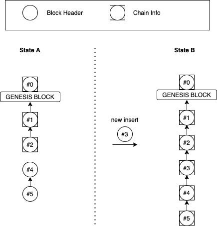
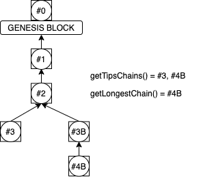
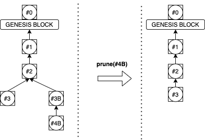
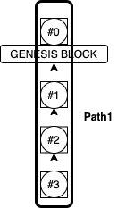
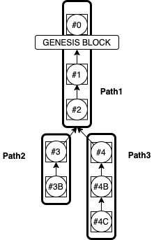
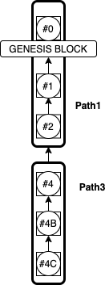

# JCL-Store

*JCL-Store* is the Storage Module in *JCL*. It provides capabilities to Store information about blocks and Transactions.
It provides several *Interfaces/Components*, each one providing 
a different set of functionalities.

> for specific implementation of the interfaces defined in this documentation, go to the end of the document, *Implementations* chapter.
> 
 
The Interfaces defined in this module are the following:


 * **BlockStore:**
 This interface provides operations to save/retrieve/remove Blocks and Transactions. Blocks and Transactions are stored
 separately, but their relationship is also stored, so it's also possible to retrieve those Transactions belonging to a
 Block, for example. This interface is simple by design, so implementations can provide high performance. 
 
 * **BlockChainStore:**
 This interface is an extension of *BlockStore*, that is, it already provides all the functionalities of *BlockStore*,
 and it also adds operations to retrieve information about the *Chain* of Blocks. As Blocks are added to the Store, 
 this interface will keep track of the *Chain* of blocks, and also of any possible *Fork* that might happen. So in this
 case the Blocks are not separate entities, but now it's also possible to *traverse* the chain starting from any 
 specific Block, going back and forth through the chain, detect *Forks*, *prune* branches, etc.

  

Examples of use of these 2 interfaces are detailed in the chapters below

## BlockStore interface

This interface provides basic operations to manipulate Blocks and Transactions, and also allows for being notified about 
different Events

### Starting and stopping the Service:

The Interface provides 2 methods that must be invoked *before* and *after* its usage. The objective of these methods are implementation-specific, but they are meant for initialization and cleaning processes.

```
BlockStore db = ...                     // we get an instance of BlockStore
try {
    db.start();
    ... // do something...
} catch (Exception e) {
	e.printStacktrace();
} finally {
    db.stop();
}

```


### Saving and retrieving Blocks and Txs

The operations are quite straightforward. Once you have the Block or Transactions you want to store, you just call 
the methods:

```
// We store Blocks:
HeaderReadOnly blockHeader = ...           // we get a Block Header from somewhere
List<HeaderReadOnly> blockHeaders = ...    // We got a List of Blocks from somewhere
db.saveBlock(blockHeader);
db.saveBlocks(blockHeaders);

// We store Txs serparately:
Tx tx = ...                    // we got a Tx from somewhere
List<Tx> txs = ...             // we got a List of Txs from somewhere
db.saveTx(Tx);
db.saveTxs(txs)

```

In the example above, both Blocks and Transactions are stored separately, without relation to 
each other. In most situations, its important to also store the *link* between them. That relationship
can be stored at different points in time. For example, in the following example, the relation is 
stored at the very moment when they are saved:

```
HeaderReadOnly blockHeader = ...    // we get a Block Header
List<Tx> txs = ...                  // we got a List of Tx that belong to that Block

db.saveBlockTxs(blockHeader, txs);

```

It's also possible to store the Block and Transaction separately and set that relation later on:

```
HeaderReadOnly blockHeader = ...           // we get a Block Header
List<Tx> txs = ...             // we got a List of Tx belong to that Block

db.saveBlock(blockHeader);
db.saveTxs(txs);
txs.forEach(tx -> db.linkTxToBlock(tx, blockHeader));

```

The *linkTxToBlock* method above stores the relationship between the Block and the Txs, but the interface also provides 
other methods that allows for modifying this relationship, like:

 * ``linkTxToBlock*(...)``: Links a Tx to one Block.
 * ``unlinkTxFromBlock(...)``: Unlinks a Tx from a Block.
 * ``unlinkTx(..)``: Unlinks a Transaction from any whatever Block this Txs its linked to
 * ``unlinkBlock(...)``: Unlinks a Block form any Tx it might be linked to


> Using the methods above create a relation between a Transaction and a Block. This relation might be in one of the following scenarios:
> 
>  * A Block might be *empty*. or contain several Transactions, with no upper limit in that number of *Transactions*.
>  * A Transaction might NOT belong to any block at all. This is the situation when the Block i being mined and this Tx is not included in a block just yet.
>  * A Transaction might belong to ONLY one Block. This is the "normal" scenario where a Transaction is contained in a Block that has been mined and its part of the BlockChain.
>  * A Transaction might belong to MORE than 1 Block. This is the scenario of a FORK, where 2 or more different Blocks are competing to be the longest Chain, and they all contain the same Transaction.
>
>
>All the scenarios above are valid and can be modelled. The method ``getBlockHashLinkedToTx`` returns a *List* of those Blocks the Tx given belongs to. The returned List might an Empty list or a list with 1 or more elements, according to the scenarios described above.
> 


We can retrieve the Txs belonging to a Block. The result comes as an *Iterable* of the Transactions *Hashes* contained in that block:

```
Iterable<Sha256Hash> getBlockTxs(Sha256Hash blockHash);
```

An example of looping over the results of the previous method:


```
// We get a Block from somwhere:
BlockHeader block = ...

// We print first the Total number of Txs:
System.out.println("Number of Txs:" + db.getBlockNumTxs(block.getHash()));

// No we print every Txs contained in this block:
Iterator<Sha256Hash> txsIt = db.getBlockTxs(block.getHash()).iterator();
while (txsIt.hasNext()) {
System.out.println("Tx Hash: " + txsIt.next());
}
```

### Saving vs Linking a Transaction

Any method with the word "save" in its signature implies that it's saving an entity. But the methods named as 
*"linkXXX()"* only add a relantionship between entities that are already stores in the DB. So if we use the 
*linkXXX* methods to link Transactions and Blocks, both must have been stored previously. Some *saveXXX* methods 
perform the same operation (save + link)in a single unit, like the ``saveBlockTxs(...)`` method.


### Order of Transactions

The order of the Transactions within a Block is important. If we get a Block from the network and save it in the repository, 
we need to recover its Transactions in the same order as they are contained in the block in the first place, otherwise 
the *merkle Tree* of the Block will be no longer valid. 

The ``saveBlockTxs(...)`` and ``linkTxtoblock()...)`` methods preserve the order, inserting the Tx in the same order as they 
are stored in the parameter given. But in *JCL-Store* you can also modify these transactions, removing/unlinking Transactions 
from Ab lock, linking/adding them alter, etc. These operation might be useful when building a new Block. 

In the following examples we can see different scenarios:

The normal scenario is when we just save the Transactions in the block:

```
BlockHeader blockHeader = ... // we get a Block Header
// Let's assume we have 3 Transactions A, B and C:
List<Tx> txs = Arrays.asList(txA, txB, txC);

// We insert them along with the block:
db.saveBlock(blockHeader)
db.saveBlockTxs(txs);

// The order stored is: [txA, txB, txC]
```
 
The previous example is equivalente to this one, where we store the Block Header and Txs separately and link them later on:

```
BlockHeader blockHeader = ... // we get a Block Header
// Let's assume we have 3 Transactions A, B and C:
List<Tx> txs = Arrays.asList(txA, txB, txC);

// We insert them along with the block:
db.saveBlock(blockHeader)
db.saveTxs(txs)

// We link them together ( these method only needs the Tx Hashes, since the Txs themselves are alrady stored):
List<Sha256) txHashes = txs.stream.map(tx -> tx.getHash()).collect(Collectors.toList())
db.linkTxsToBlock(txHashes, blockHeader.getHash());

// The order stored is: [txA, txB, txC]
```

The order of the Transactions in the previous example is termined by the order of the Transaction Hashes in the call 
to ``linkTxsToblock()`` method, so if we change it we have:


```
// We change the order of the Ttransaction Hashes:

List<Sha256) txHashes = Arrays.asList(txB.getHash(), txC.getHash(), txA.getHash())
db.linkTxsToBlock(txHashes, blockHeader.getHash());

// The order stored is: [txB, txC, txA]
```

Every time we *link* a Transaction to a Block, it gets "appended" at the end of the Block:

```
// current content is [ txA, txB, txC ]
db.unlinkTxFromBlock(txB.getHash(), blockHeader.getHash());

// current content is [ txB, txC ]
db.unlinkTxFromBlock(txB.getHash(), blockHeader.getHash());

// current content is [ txB, txC, txA ]
```

### Streaming of Events

The *BlockStore* interface provides an *endpoint* that can be used to *listen* to *Events* that are triggered when some 
operations are performed:

 * when blocks are stored
 * when blocks are removed
 * when Txs are stored
 * when Txs are removed


The endpoint is the *EVENTS()* method, and we can *listen* to an Event by providing a *callback* by using the *forEach* 
method, in a similar way as with the *Java Streams*:

```
db.EVENTS().BLOCKS_SAVED.forEach(System.out::println)
db.EVENTS().BLOCKS_REMOVED.forEach(System.out::println)
db.EVENTS().TXS_SAVED.forEach(System.out::println)
db.EVENTS().TXS_REMOVED.forEach(System.out::println)

```

The examples above are using a very simple *lambda* expression that just prints out the Event received, but we can 
develop a custom method that does the same thing, and also gives us access to the *Event* object:

```
db.EVENTS().BLOCKS_SAVED.forEach(this::processBlocksSaved)
db.EVENTS().BLOCKS_REMOVED.forEach(this::processBlocksRemoved)
db.EVENTS().TXS_SAVED.forEach(this::rocessTxsSaved)
db.EVENTS().TXS_REMOVED.forEach(this::processTxsRemoved)
...
public void processBlocksSaved(BlocksSavedEvent event) {
    System.out.println(event);
}
public void processBlocksRemoved(BlocksRemovedEvent event) {
    System.out.println(event);
}
public void processTxsSaved(TxsSavedEvent event) {
    System.out.println(event);
}
public void processTxsRemoved(TxsRemovedEvent event) {
    System.out.println(event);
}

```


> **NOTE:**
> 
> Triggering Events might affect the performance. The *BlockStore* interface describes *how* to 
access them, but it can NOT guarantee whether they are enable or not. Enabling or disabling the Events 
is implementation-specific, so **go check the implementation documentation** for the guidelines about how
to enable/configure the trigering of Events.


### Filtering of Events

All the Events streamed by the *BlockStore* components can also be filtering out by using a *filter()* method, which 
accepts a *Predicate* as an argument and can be used in a similar way as the *Java Streams*:

```
...
ShaWrapper blockHashToSearch = ShaWrapper.wrap("000000000000000001f013dffd431ef7b833197d78bb22f9f81cfec4659db7ba")
db.EVENTS().BLOCKS_SAVED
    .filter(e -> e.getBlockHashes().contains(BlockHashToSearch))
    .forEach(e -> System.out.println("Block " + blockHashToSearch + " inserted.")
...
```

The previous example prints out a Message only when a specific Block has been Saved


### Comparing Blocks

In some scenarios, it's useful to compare 2 Block, to check what Transactions they have in common, or what Transaction on of them has but not the other one. For this scenario you can use the following method:

```
Optional<BlocksCompareResult> compareBlocks(Sha256Wrapper blockHashA, Sha256Wrapper blockHashB);
```

That Methods return the result *inmediately*. That result is composed of several *iterables*, each one of them showing different information: one will iterate over the Transactions both blocks have in common, another will do the same but over those Transactions that only the first Block has but not the second, etc. The complexity here is not coming from getting the result (which is inmediate), but from iterating those results (whch might take more or less time depending on the number of Txs, but the complexity to loop over the whole set of Transaction is *O(n)*.

### Getting previous (predecessor) Transactions

A Transaction *A* depends on a Transactions *B* and *C* if *A* is using some of the *outputs* from *B* and *C*. So the Transaction *A* will ony be validated after the Transactions *B* and *C* have been validated as well.

There is a specific method to retrieve the *Transactions* that one Transaction relies on:

```
List<Sha256Hash> getPreviousTxs(Sha256Hash txHash);
```

In the example above, this method will return a list containing the *Hashes* of the Transactions *B* and *C*.

> Note that in this example, the Transaction *B* and *C* might NOT be stored yet in the DB, since the Transactions might come in different order when you receive them from the network.


### Saving Metadata

All the previous operations allows to save, retrieve and update *Blocks* and/or *Transactions*. But in some scenarios it might be usefl to store *more* information about them, for example:

* A flag indicating if a *Transaction* is validated
* A field indicating the number of *Peers* that have boadcast a specific *Block* or *Transaction*
* A field indicating a *custom* metric based on *custom* calculations made on a *Block*
* etc

The *BlockStore* Module allows to define *Metadata* and attach it to a Block. Since the specific *Metadata* 
to store for each block might be completely different depending on the application or needs of the user, the definition 
of the *Metadata* is up to the user, adn once it's done *JCL* only needs to be "informed" of that so it can use it in 
conjunction with the rest of operations with Blocks.

A *Metadata* is a JAva class that needs to fulfill 2 criteria:
 * It must have a default Constructor (no parameters). But it can contain others if needed.)
 * It must implement the *Metadata* interface.


The *Metadata* interface only specifies 2 methods which are used for Serialization/Deserialization:

```
public interface Metadata {
    /** Serializes the content of the Class into a Array of Bytes */
    byte[] serialize();
    /** It parses the data fromm a Byte Array, deserializes it and loads/populates the content of the Class */
    void load(byte[] data);
}
```

*JCL* has already ou-of-the-box some Utiity *Metadata* Classes that can be used. For example, the 
class ``BlockValidationMD``, which contains useful information that
can be used to track the progress of downloading/Validating a Block from the P2P Network.

The next ste it to *inform* *JCL* that the ``BlockValidationMD`` class will be used as a *Metadata* for blocks (and 
even thought this is more related to a specific implementation, we are shoding here a piece of code of the *LevelDB* 
configuration process):

```
BlockStore db = BlockStoreLevelDB.builder()
                ...
                .blockMetadataClass(BlockValidatorMD.class) // HERE
                .build()

```

After starting the DB, we can now make use of the new methods available for working with *Metadata*:

```
    /** Retrieves the metadata attached to the block given, if any */
    Optional<Metadata> getBlockMetadata(Sha256Hash blockHash);

    /** It saves some Metadata linked to a Block */
    void saveBlockMetadata(Sha256Hash blockHash, Metadata metadata);

    /** It removes metadata linked to a Block */
    void removeBlockMetadata(Sha256Hash blockHash);
```

The methods above are straightforward. Basically allows us to access/save/remove *metadata* that we can 
reference by the *Hash* of a Block. Other operations are done transparently, like removing the *Metadata* of a 
Block when the block itself is removed.


### Reference

#### *Events* streamed by the *BlockStore* interface:

##### BlocksSavedEvent

An Event triggered when a one or more Blocks have been saved in the Store.
 This Event is accesible by: ``[BlockStore].EVENTS().BLOCKS_SAVED``
 
 The Event class passed as parameter to the *forEach* method is an instance of
``BlocksSavedEvent``

##### BlocksRemovedEvent

An Event triggered when a one or more Blocks have been removed from the Store.
 This Event is accesible by: ``[BlockStore].EVENTS().BLOCKS_REMOVED``
 
 The Event class passed as parameter to the *forEach* method is an instance of
``BlocksRemovedEvent``


##### TxsSavedEvent

An Event triggered when a one or more Txs have been saved in the Store.
 This Event is accesible by: ``[BlockStore].EVENTS().TXS_SAVED``
 
 The Event class passed as parameter to the *forEach* method is an instance of
``TxsSavedEvent``


##### TxsRemovedEvent

An Event triggered when a one or more Txs have been removed in the Store.
 This Event is accesible by: ``[BlockStore].EVENTS().TXS_REMOVED``
 
 The Event class passed as parameter to the *forEach* method is an instance of
``TxsRemovedEvent``


## BlockChainStore interface

The *BlockChainStore* component is an *extension* of the *BlockStore* Module. It provides *ALL* the capabilities that
*BlockSore* does, and it also adds more. The new functionalities here are all about providing information of the *Chain* 
of Blocks.

In the *BlockStore* component, both *Blocks* and *Transactions* are separate entities. We can link a *Transaction* to a
Block so we can get all the *Transactions* belonging to a Block, and we can also *travel* from a Block to its *parent*,
 since that information is contained within the *BlockHeader* itself, but that's all we can do.
 
The *BlockChainStore* interface, on the other hand, provides much more information. *Blocks* are part of a *Chain*, which is a sequence of *Blocks* in an specific order. The *BlockChainStore* components offers new methods to provide
 useful information about this *Chain*, like:
 
  * get relative information about the *Chain*, like its *height* or proof of Work. This information is "relative" because
    its specific for a particular *Block*. Another *Block* in the same chain will have a different *height* and a 
    different *proof of Work*.
  * Useful method to *traverse* the chain, not ony from a *Block* to it's *parent*, but also from a *Block*
    to its "children", so you can *traverse* back and forth.
  * It keeps track of the *Tips* of the *Chain* (the most recent *Blocks* stored)
  * In case there is a *Fork* (more than 2 chains are being built on top of a Block), it also keeps track of all those
    individual "Chains".
  * It provides methods to "prune" a Chain. This process can also be performed automatically.
  * It provides the *History* of a Block. This *History* is a sequence of Events, from the very begining of the *Chain* until the cretion of the *Block* iself, along with all the *Forks* that happened in between. Even if those *Forks* are then discarded by the network and even pruned, the information about a fork "happening" at that height is still recorded.


### Getting Chain Information

The *getBlockChainInfo()* accetps a *Block Hash* as a parameter and returns an instance of *ChainInfo*, which stores
information about the *Chain* that Block belongs to. This information is relative to this *Block*. If the *Block* is 
not Store, or it's stored but its *NOT* connected to a *Chain* (because for instance its parent has not been stored yet,
since *Blocks* might be stored in a different order), then it returns an *Empty* Optional.

```
Optional<ChainInfo> getBlockChainInfo(Sha256Hash blockHash);
```

In the following picture we can see 2 examples of the DB state at 2 points in time: In the **State A**, 5 blocks are stored: *genesis*, #1, #2, #4 and #5. Only the Blocks #1 and #2 are connected to the Chain, so we only have **ChainInfo** for them. In the **State B**, the Block #3 is inserted, and at this moment is automatically **connected** to the Chain, since it's parent (#2) is already stored. And this **connection** process is also triggered through all the Blocks built on top of #3, so in the end all the blocks are connected and we can potentially get **ChainInfo** from all of them.




### Traversing the Chain

Using the original *BlockStore* Component is already possible to travel from a *Block* to its parent, and by repeating
this process you could go up to the beginning of the *Chain*. The *BlockChainStore* makes this "traversing" more 
explicit by adding methods to go "back" to its parent and "forth" to the *Children* of a *Block* given:

```
Optional<Sha256Hash> getPrevBlock(Sha256Hash blockHash);
List<Sha256Hash> getNextBlocks(Sha256Hash blockHash);
```

In a regular situation when we only have one *Chain*, the ``getNextBlocks`` will return either a List of one *Block*, or 
an empty list. But in the rare case there is a *Fork* beginning at this *Block*, we might have *more* than one *children*, 
so that's why the methods returns a *List*.


### Tips of the Chains

The *BlockChainStore* components provides methods to get direct information about the *Tips* of the *Chains* stored in
the DB:

```
List<Sha256Hash> getTipsChains();
Optional<ChainInfo> getLongestChain();
```

An example of the the preovous method used on the following DB State:




### Forks and prunning

Due to the nature itself of the *BlockCHain*, a *Fork* might appear from time to time. A *Fork* is a situation where 
*more* than 1 *Blocks* are being built on top of an existing *Block*, so we end up with 2 different *Chains*. 

> The *BlockChainStore* component, as we'll see in another chapter further down, can send *notifications* (Events) when 
a *Fork* is detected.

These 2 chains keep growing, but over time the *P2P* network chooses automatically the best/longest one, and the other is 
abandoned so no further Blocks are built on top of it. But even if one *Chain* is abandoned, the blocks that were 
originally built on top of that are still stored in the DB, so it's a good idea to remove them once the Chain as been discarded
by the Network. The *BlockChainStore* Component provides 2 ways to "remove/prune" a *Chain*:

 * by using the *prune()* method.
 * by letting the *BlockChainStore* component to do it automatically.
 

The *prune()* methods allows for removing a *Chain* by specifying the *Block* that makes the *Tip* of that Chain. All 
the Blocks belonging to that *Chain* will be removed, starting from its *Tip* and all the way back until the moment the 
*Fork* was created.

The following example shows the state of the Chain before and after prunning a Fork. notice that only the *Tip* of the Fork needs to be specified in the **prune** method:



#### Automatic prunning

The problem with the *prune()* method is that is not easy to know when its "safe" to *prune* a Chain. A *Chain* can *ONLY* 
be safely removed when that Chain has been discarded by the Network and no *Blocks* are being built on top of it. So it's not 
enough to "know" when a *FORK* has happened, we also need to *wait* until we are sure that the *Chain* is not the longest 
one and it can be removed. For all these reasons, the *BlockChainSore* also includes, as part of its specification, an 
"automatic" prunning system:

> By enabling the *Automatic Prunning*, the *BlockChainStore* Component will take care of keeping track of all the *Chains*, and
it will also detect when the right time for removing/prunning one of them is. A *Chain* can safely be removed when the 
difference in height with the longest *Chain* is bigger than a *Threshold* specified. The *Automatic Prunning* Configuration
is implementation-specific, so **go check the specific implementation**:

The next chapters below explain how the chain *History* is stored and the methods available to read it.

### Block History

The *BlockChainStore* module uses the concept of *Path* to store information about the *history* of the chain. A *Path* is a sequence of blocks in sequence, without any fork between them. Over time, as Forks are created and discarded, the *BlockChainStore* changes and stores this information so it can be used later on to bring up a block's history.

Some examples of *Paths* are showed below:

In this picture, we have a chain of 4 Blocks. There is only 1 Path, from *genesis* up to the *Tip*:



If later on a Fork occurs, then the original Path is broken down:



When later on one of the forks is discarded by the Network and *pruned* by *BlockChainStore*, then the *Path* is deleted, but the previous structure remains:



The fact that the previous Paths are still there after removing a branch allows the *BlockChainStore* module to *know* the complete history of the block. In the previous example, the *History* of the Block 4 can be summed up as:

* [date 1]: Creation of the Genesis block 
* [date 2]: Fork at height #2
* [date 3]: Creation of block #4C

In this example, we *know* that there's been a Fork at a specific point in time, *even though the fork itself is now gone*.


#### Block History Operations

The *getFirstBlockInHistory(blockHash)* returns the *Hash* of the Block that is the *parent* of 
the first Block prior to the block given, or the *genesis* block if there is no Fork or the forks have been pruned.

```
Optional<ChainInfo> getFirstBlockInHistory(Sha256Hash blockHash);
```

> *PENDING TO ADD MORE METHODS IN THIS SECTION...*


### Streaming of Events

In a similar fashion as the *BlockStore* Component, the *BlockChainStore* component also streams some Events, and those 
Events can be subscribed to, so we can get notified and run our business logic. 

 * You can subscribe to a *FORK* Event, which happens when a *Fork* is detected
 * You can subscribe to a *PRUNE* Event, which happens when a *Chain* has been pruned, either manually (by the ``prune()``
   method), or automatically
 * You can subscribe to a *STATE* Event, which will be explained in a separate chapter.   


#### State Streaming

Apart form the *Events* triggered when some operations are performed, the *BlockChainStore* interface also provides 
an *endpoint* to an Event that can be triggered on a scheduled basis. This is the case of the *STATE* event. The *STATE*
event is an Event that is triggered using a pre-defined frequency set up by the user, and it contains useful information
about the state of the DB (Number of Blocks, Txs, etc) 

```
db.EVENTS().STATE.forEach(System.out::println)
```

> Enabling the Streaming of *STATE* Events is implementation-specific, so **go check out** the implementation documentation:


### Reference

#### *Events* streamed by the *BlockChainStore* interface:

##### ChainForkEvent

An Event triggered when a Fork is detected: when a *Block* has just been saved, and the *parent* of this *Block* has
ALREADY other Block built on top of it.
 This Event is accesible by: ``[BlockStore].EVENTS().FORKS``
 
 The Event class passed as parameter to the *forEach* method is an instance of
``ChainForkEvent``

##### ChainPruneEvent

An Event triggered when a *Chain* has just been pruned. This might happen on-demand (by invoking the *prune()* method), or
automatically (by the *Automatic Prunning*)
 This Event is accessible by: ``[BlockStore].EVENTS().BLOCKS_REMOVED``
 
 The Event class passed as parameter to the *forEach* method is an instance of
``ChainPruneEvent``


##### ChainStateEvent

An Event triggered periodically based on the configuration (implementation-specific) provided.
 This Event is accesible by: ``[BlockStore].EVENTS().STATE``
 
 The Event class passed as parameter to the *forEach* method is an instance of
``ChainStateEvent``


# Implementations

In *JCL-Store*, only guidelines about how to use the interfaces is provided. Before using an interface an instance
must be obtained, but that process is implementation-specific. So for instructions of how to crete instances of 
the interfaces above, go check out the documentation of all the implementations provided:

[JCL-Store-LevelDB](https://bitbucket.org/nchteamnch/java-component-library/src/develop/store-levelDB/doc/README.md): *JCL-Store* implementation with LevelDB 
 
[JCL-Store-FoundationDB](https://bitbucket.org/nchteamnch/java-component-library/src/develop/store-foundationDB/doc/README.md): *JCL-Store* implementation with FoundationDB 
